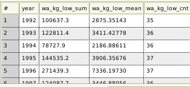
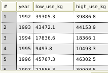
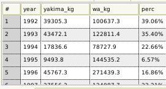
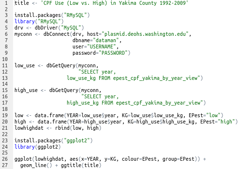
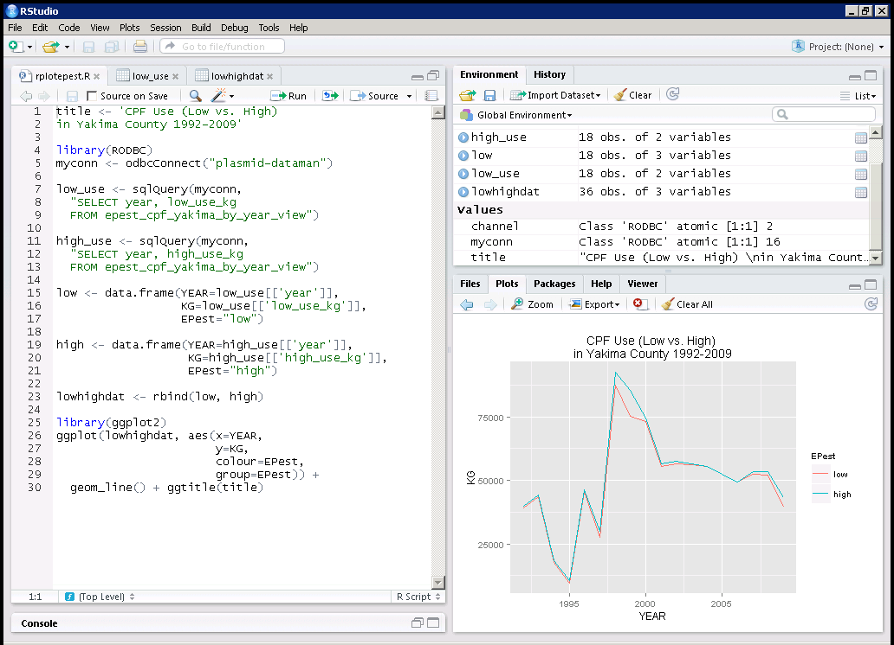

Data Management
========================================================

For Scientific Research

[//]: # (author: Brian High, UW DEOHS)
[//]: # (date: 2014-05-23)
[//]: # (license: CC0 1.0 Universal,linked-content/images)
[//]: # (note: License does not apply to external content such as quoted material, linked web pages, images, or videos. These are licensed separately by their authors, publishers or other copyright holders. See attribution links for details.)
[//]: # (note: Any of the trademarks, service marks, collective marks, design rights, personality rights, or similar rights that are mentioned, used, or cited in the presentations and wiki of the Data Management For Scientific Research workshop/course are the property of their respective owners.)
[//]: # (homepage: https://github.com/brianhigh/data-workshop)

<p style="width: 600px; float: right; clear: right; margin-bottom: 5px; margin-left: 10px; text-align: right; font-weight: bold; font-size: 14pt;">Photo: &copy; <a href="http://www.stanza.co.uk/body/index.html">Stanza</a>. Used with permission.</p>

Session 7: Applied SQL
========================================================

Today we will be applying our data cleanup and SQL skills to our current research projects.

<p style="width: 500px; float: left; clear: right; margin-bottom: 5px; margin-left: 10px; text-align: right; font-weight: bold; font-size: 14pt;">Image: <a href="http://commons.wikimedia.org/wiki/File:SQL_ANATOMY_wiki.svg">SqlPac / Ferdna / Wikimedia</a></p>


Example: Estimated Pesticide Use
========================================================

We want to download some files from the USGS listing estimated pesticide use in the United States.

http://pubs.usgs.gov/ds/752/

From these files, we want to ...

* Produce statewide yearly pesticide totals

* Compare "high" and "low" [chlorpyrifos](http://en.wikipedia.org/wiki/Chlorpyrifos) (CPF) use

---

<p style="width: 320px; float: left; clear: right; margin-bottom: 5px; margin-left: 10px; text-align: right; font-weight: bold; font-size: 14pt;">Image: <a href="http://en.wikipedia.org/wiki/File:Chlorpyrifos-3D-vdW.png"> Benjah-bmm27 / Wikimedia</a></p>

Download the Files
========================================================

While we could manually download each text file from the website, on by one, we are going to automate this process.

Here is one way to grab all of those text files with one Bash shell command:

```
wget -q --no-parent \
     -e robots=off \
     --recursive \
     --accept=txt \
     --no-directories \
     http://pubs.usgs.gov/ds/752/
```

This can be pasted into the Bash shell and run as one multiline command.

You will download 14 text files totalling about 266 MB in size.

Combine the Files
========================================================

We can use a Bash command loop to combine the "high" pesticide use and "low" use files. 

"High" and "low" represent the two different [EPest Methods](http://water.usgs.gov/nawqa/pnsp/usage/maps/about.php) that we want to compare.

In our ```for``` loop we will ```use tail -n +2``` to skip the first line of each file.

```
for i in high low; do \
    tail -q -n +2 \
        EPest.${i}.*.table*.txt > \
        EPest.${i}.county.estimates.txt
done
```

Now we have a file for "high" and another file for "low".

Create Database Tables
========================================================

Run these commands in MySQL:

```
CREATE  TABLE IF NOT EXISTS `epest_high` (
  `id` INT UNSIGNED NOT NULL AUTO_INCREMENT,
  `compound` VARCHAR(45) NULL,
  `year` YEAR(4) NULL,
  `state_fips_code` SMALLINT NULL,
  `county_fips_code` SMALLINT NULL,
  `high_use_kg` NUMERIC(8,1) NULL,
  PRIMARY KEY (`id`) )
ENGINE = InnoDB;

CREATE  TABLE IF NOT EXISTS `epest_low` (
  `id` INT UNSIGNED NOT NULL AUTO_INCREMENT,
  `compound` VARCHAR(45) NULL,
  `year` YEAR(4) NULL,
  `state_fips_code` SMALLINT NULL,
  `county_fips_code` SMALLINT NULL,
  `low_use_kg` NUMERIC(8,1) NULL,
  PRIMARY KEY (`id`) )
ENGINE = InnoDB;
```

Import the Data
========================================================

Copy the two combined files to /Data/high/ and import them.

Bash:

```
cp EPest.*.county.estimates.txt /Data/high/
```

MySQL:

```
LOAD DATA INFILE 
'/Data/high/EPest.high.county.estimates.txt' 
INTO TABLE epest_high 
(compound, year, state_fips_code, county_fips_code, high_use_kg);

LOAD DATA INFILE 
'/Data/high/EPest.low.county.estimates.txt' 
INTO TABLE epest_low 
(compound, year, state_fips_code, county_fips_code, low_use_kg);
```

Add Indexes to Tables for Performance
========================================================

This will speed up our later queries.

MySQL:

```
ALTER TABLE epest_high 
ADD INDEX year_state_county 
(`year`, `state_fips_code`, `county_fips_code`);

ALTER TABLE epest_low 
ADD INDEX year_state_county 
(`year`, `state_fips_code`, `county_fips_code`);
```

Find Annual "EPest Low" Use in WA
========================================================

```
SELECT year, 
SUM(low_use_kg) AS `wa_kg_low_sum`, 
AVG(low_use_kg) AS `wa_kg_low_mean`, 
COUNT(low_use_kg) AS `wa_kg_low_cnt` 
FROM epest_low  
WHERE state_fips_code = 53
GROUP BY year 
ORDER BY year;
```


Save that Query as a View
========================================================

```
CREATE VIEW epest_low_wa_by_year_view AS 
SELECT year, 
SUM(low_use_kg) AS `wa_kg_low_sum`, 
AVG(low_use_kg) AS `wa_kg_low_mean`, 
COUNT(low_use_kg) AS `wa_kg_low_cnt` 
FROM epest_low  
WHERE state_fips_code = 53
GROUP BY year 
ORDER BY year;

SELECT * FROM epest_low_wa_by_year_view;
```


Create a View for EPest Low WA CPF Use
========================================================

```
CREATE VIEW epest_cpf_low_wa_by_year_view AS 
SELECT year, 
SUM(low_use_kg) AS `wa_kg_low_sum`, 
AVG(low_use_kg) AS `wa_kg_low_mean`, 
COUNT(low_use_kg) AS `wa_kg_low_cnt` 
FROM epest_low  
WHERE compound = 'CHLORPYRIFOS' 
AND state_fips_code = 53
GROUP BY year 
ORDER BY year;

SELECT * FROM epest_cpf_low_wa_by_year_view;
```



Analyze EPest Low CPF use in Yakima Co.
=========================================================

```
SELECT year, 
SUM(low_use_kg) AS `yakima_kg_low_sum`, 
AVG(low_use_kg) AS `yakima_kg_low_mean`, 
COUNT(low_use_kg) AS `yakima_kg_low_cnt` 
FROM epest_low 
WHERE state_fips_code = 53 
    AND county_fips_code = 77 
GROUP BY year 
ORDER BY year;
```


Compare High and Low for Yakima Co.
=========================================================

```
CREATE VIEW epest_cpf_yakima_by_year_view AS 
SELECT l.year AS year,  
    l.low_use_kg AS low_use_kg, 
    h.high_use_kg AS high_use_kg 
FROM epest_low AS l 
    INNER JOIN epest_high AS h 
ON (l.compound = h.compound 
    AND l.year = h.year 
    AND l.state_fips_code = h.state_fips_code 
    AND l.county_fips_code = h.county_fips_code) 
WHERE l.state_fips_code = 53 
    AND l.county_fips_code = 77 
    AND l.compound = 'CHLORPYRIFOS' 
ORDER BY year;

SELECT * FROM epest_cpf_yakima_by_year_view;
```



Compare Yakima CPF Use to WA
=========================================================

```
SELECT y.year AS year, 
    y.low_use_kg AS yakima_kg, 
    t.wa_kg_low_sum AS wa_kg, 
    CONCAT(ROUND(( y.low_use_kg/t.wa_kg_low_sum * 100 ),2),'%') AS `perc`
FROM epest_cpf_yakima_by_year_view y 
JOIN epest_cpf_low_wa_by_year_view t 
ON t.year = y.year 
ORDER BY year;
```




Hands-on Group Exercise
========================================================

We will work some more with this database and produce some plots.


Discussion
========================================================

We will discuss your SQL queries and plots.

<p style="width: 275px; float: left; clear: right; margin-bottom: 5px; margin-left: 10px; text-align: right; font-weight: bold; font-size: 14pt;">Graphic: <a href="http://upload.wikimedia.org/wikipedia/commons/e/eb/User_journey_discussion.png">Jagbirlehl / Wikimedia</a></p>


Connecting from R
========================================================

Here are two ways to connect to the MySQL database from R.

Using RMySQL:

```{sql}
install.packages("RMySQL")
library("RMySQL")
drv <- dbDriver("MySQL")
myconn <- dbConnect(drv, host="plasmid", 
  dbname="dataman", user="USERNAME", 
  password="PASSWORD")
```                    

Using RODBC and a DSN:

```{sql}
install.packages("RODBC")
library(RODBC)
myconn <- odbcConnect("plasmid-dataman")
```

R Script Using RMySQL and ggplot2
=======================================================



As you can see, one downside of using a DSN-less connection is that the username and password is in the script.

R Plot Using ggplot2
=======================================================


```
ggplot(lowhighdat, aes(x=YEAR, y=KG, colour=EPest, group=EPest)) +
  geom_line() + ggtitle(title)
```
---


R Script Using RODBC and ggplot2
=======================================================



In the Coming Sessions...
========================================================

* Project Management
* Version Control
* Data Security
* Systems Administration

Action Items (videos, readings,  and tasks)
========================================================

<table>
   <tr border=0>
      <td width="128" valign="middle">
      </td>
      <td valign="middle">
         <ul>
            <li><a href="https://www.youtube.com/watch?v=aWY3nTVR8vk">Redmine A Guided Tour</a>
            <li><a href="https://www.youtube.com/watch?v=9WC4P8t7T8w">Who should use Git?</a>
            <li><a href="https://www.youtube.com/watch?v=LXoWxrTdXkM">GitHub for Beginners</a>
            <li><a href="https://www.youtube.com/channel/UCP7RrmoueENv9TZts3HXXtw">GitHub Training & Guides</a> (watch a few -- <a href="https://www.youtube.com/watch?v=FyfwLX4HAxM&list=PLg7s6cbtAD15G8lNyoaYDuKZSKyJrgwB-">like this playlist</a>)
         </ul>
      </td>
   </tr>
   <tr>
      <td width="128" valign="middle">
      </td>
      <td valign="middle">
         <ul>
            <li><A href="http://practicalcomputing.org/about">PCfB</a> textbook: Chapter 20. Working on Remote Computers
            <li>Skim: <a href="http://seattle.bibliocommons.com/item/show/2897906030_sams_teach_yourself_sql_in_10_minutes,_fourth_edition">SAMS Teach Yourself SQL on 10 Minutes</a>: Ch. 9-14
            <li>Optional- Skim: <a href="http://www.amazon.com/dp/0123747309">RDDaI3CE</a> textbook: Chapter 17
            <li>Optional- Skim: <a href="http://www.amazon.com/dp/0123756979">SQLCE3</a> textbook: Chapters 5-8
         </ul>
      </td>
   </tr>
   <tr>
      <td width="128" valign="middle"></td>
      <td valign="middle">
         <ul>
            <li>Clean up any external data files you may have.
            <li>Import your external data into your database.
            <li>Check your database tables and resolve any errors.
            <li>Query your database for to answer research questions.
         </ul>
      </td>
   </tr>
</table>


See Also
========================================================

To prepare for next week...

* [Project Management](http://en.wikipedia.org/wiki/Project_management),  [Version Control](http://en.wikipedia.org/wiki/Version_control), [diff](http://en.wikipedia.org/wiki/Diff), and [patch](http://en.wikipedia.org/wiki/Patch_%28Unix%29)
* [Mastering Redmine](http://seattle.bibliocommons.com/item/show/2920711030_mastering_redmine) eBook
* [Version Control With Git, 2nd Edition](http://seattle.bibliocommons.com/item/show/2847665030_version_control_with_git,_2nd_edition) eBook
* [Git - Version Control for Everyone](http://seattle.bibliocommons.com/item/show/2937299030_git_-_version_control_for_everyone) eBook
* [Git Magic](http://www-cs-students.stanford.edu/~blynn/gitmagic/) eBook
* [Getting Started with GitHub + Git](https://www.youtube.com/watch?v=DVDLoe_2MBc) video
* Project Pages: [Redmine](http://www.redmine.org/), [Git](http://git-scm.com/), [GitHub](https://github.com/)
* [Implementing Redmine for Secure Project Management](http://www.sans.org/reading-room/whitepapers/testing/implementing-redmine-secure-project-management-34122)
* [Code School - Try Git](https://try.github.io/levels/1/challenges/1) - 15 minute online Git tutorial
* [6 Useful Graphical Git Client for Linux](http://www.maketecheasier.com/6-useful-graphical-git-client-for-linux/) Guide

Questions and Comments 
========================================================

<p style="width: 380px; float: right; clear: right; margin-bottom: 5px; margin-left: 10px; text-align: right; font-weight: bold; font-size: 14pt;">Image: <a href=http://commons.wikimedia.org/wiki/File:Happy_Question.svg">© Nevit Dilmen</a> / Wikimedia</p>

