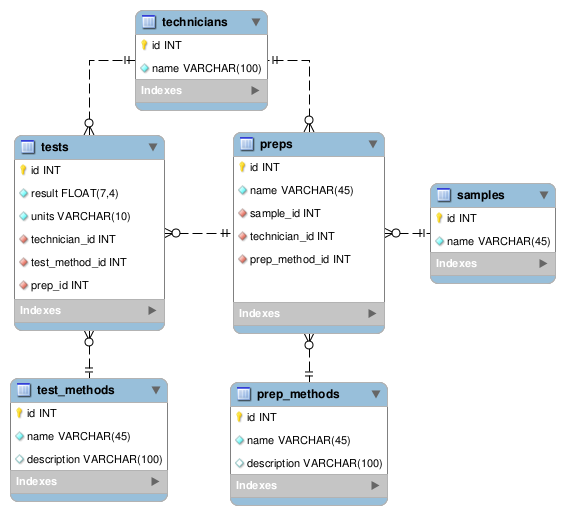

Data Management
========================================================

For Scientific Research

[//]: # (author: Brian High, UW DEOHS)
[//]: # (date: 2014-05-06)
[//]: # (license: CC0 1.0 Universal, linked-content/images)
[//]: # (note: License does not apply to external content such as quoted material, linked web pages, images, or videos. These are licensed separately by their authors, publishers or other copyright holders. See attribution links for details.)
[//]: # (note: Any of the trademarks, service marks, collective marks, design rights, personality rights, or similar rights that are mentioned, used, or cited in the presentations and wiki of the Data Management For Scientific Research workshop/course are the property of their respective owners.)
[//]: # (homepage: https://github.com/brianhigh/data-workshop)

Photo: &copy; <a href="http://www.stanza.co.uk/body/index.html">Stanza</a>. Used with permission.

Session 5: Building Database Tables
========================================================

Today we will use an example to review data models and create a database using MySQL Workbench.

Please open up MySQL Workbench so you can follow along.

As we design the database on the screen, you should also create the same database design in MySQL Workbench on your own computer.

We will use the design to automatically create the database tables.

Example: Sample Testing
========================================================

Structured Narrative:

1. *Technician* prepares *prepared sample* from *sample* using *preparation method*.

2. *Technician* performs *lab test* on *prepared sample* using *test method*.

The entities have been italicized. We will assume that all necessary computer interactions (i.e. data entry steps) are included in the "prepares" and "performs" actions.

Identifying the Entities and Relationhsips
========================================================

And putting them in a table...

| Entity | Relationship | Entity | Relationship | Entity |
| ------ | ------------ | ------ | ---| --- |
| Technician | prepares | prepared sample | from | sample |
| | | -> | using | preparation method |
| Technician | performs | lab test |on | prepared sample 
| | | -> | using | test method |

Conceptual Data Model
========================================================

Canine AT-AT Model
========================================================

Photo: <a href="http://starwarsblog.starwars.com/2011/10/19/meet-bones-the-at-at-dog/">John Nolan / Katie Mello / Star Wars Blog</a>

Logical Data Model
========================================================

Working together, we will create this EER diagram in MySQL Workbench.

Discussion
========================================================

Explain our EER diagram.

Photo: <a href="http://starwarsblog.starwars.com/2011/10/19/meet-bones-the-at-at-dog/">John Nolan / Katie Mello / Star Wars Blog</a>

Generating Database Tables
========================================================

Using the "Forward Engineer" feature, we can save a schema file and create tables. The tables can be explored in "SQL Editor".

Logical Data Model Modified
========================================================

In order to use these tables for generating a website with a framework (like CakePHP), we will need to make our table names plural to conform with the framework's conventions.

Logical Data Model Expanded
========================================================

By adding more tables, we can track additional entities:

* Measurement Units
* Sample Type (Matrix)
* Clients
* Sample Disposal
* Instruments
* Instrument Detection Limits (IDLs)
* Method Detection Limits (MDLs)

---

Database with Web Interface
========================================================

With a few shell commands, we can create a functioning web application from our database schema. More on that later!

In the Coming Sessions...
========================================================

* Structured Query Language (SQL)
* Database Applications and Web Frameworks
* Embedded SQL

Action Items (videos, readings,  and tasks)
========================================================

<table>
   <tr border=0>
      <td width="128" valign="middle">
      </td>
      <td valign="middle">
         <ul>
            <li><a href="https://www.youtube.com/watch?v=bk0n2QLLxPI">MySQL WB: Creating an Entity-Relationship Diagram</a>
            <li><a href="https://www.youtube.com/watch?v=D7uPOU0C5K4">MySQL WB: Basic Relationships </a>
            <li><a href="https://www.youtube.com/watch?v=HusL582R2TY">MySQL WB: Modeling Relationships in a MySQL ERD</a>
            <li><A href="https://www.youtube.com/watch?v=_TA40PY3R6A">MySQL WB: Building a Database from an ERD</a>
         </ul>
      </td>
   </tr>
   <tr>
      <td width="128" valign="middle">
      </td>
      <td valign="middle">
               <ul>
            <li><A href="http://practicalcomputing.org/about">PCfB</a> textbook: Chapters 14 and 15
            <li>Skim: <a href="http://seattle.bibliocommons.com/item/show/2897906030_sams_teach_yourself_sql_in_10_minutes,_fourth_edition">SAMS Teach Yourself SQL on 10 Minutes</a>: Ch. 1-4
            <li>Optional- Skim: <a href="http://www.amazon.com/dp/0123756979">RDDaI3CE</a> textbook: Chapters 7-8
            <li>Optional- Skim: <a href="http://www.amazon.com/dp/0123756979">SQLCE3</a> textbook: Chapters 1-2
         </ul>
      </td>
   </tr>
   <tr>
      <td width="128" valign="middle"></td>
      <td valign="middle">
         <ul>
            <li> Normalize your <a href="http://en.wikipedia.org/wiki/Logical_data_model">Logical Data Model</a> (<a href="http://en.wikipedia.org/wiki/Entity-relationship_diagram">ERD</a>) in MySQL WB
            <li> "Forward Engineer" your ERD to create a schema file and tables
            <li> Post your schema and EER diagram(s) in your project wiki
            <li> Refer to the <a href="https://github.com/brianhigh/data-workshop/wiki/Example-Entity-Relationship-Diagram-%28ERD%29">example</a> in the "Data Management" project wiki
         </ul>
      </td>
   </tr>
</table>

See Also
========================================================

* [MySQL WB Reference Manual](http://dev.mysql.com/doc/workbench/en/index.html)
* [SQL Integrity Constraints](http://beginner-sql-tutorial.com/sql-integrity-constraints.htm)
* [Database Schema](https://en.wikipedia.org/wiki/Database_schema)
* [Schema](http://www.webopedia.com/TERM/S/schema.html)
* [SQLite vs MySQL vs PostgreSQL: A Comparison Of Relational Database Management Systems](https://www.digitalocean.com/community/articles/sqlite-vs-mysql-vs-postgresql-a-comparison-of-relational-database-management-systems)

Questions and Comments 
========================================================

Image: <a href=http://commons.wikimedia.org/wiki/File:Happy_Question.svg">© Nevit Dilmen</a> / Wikimedia

