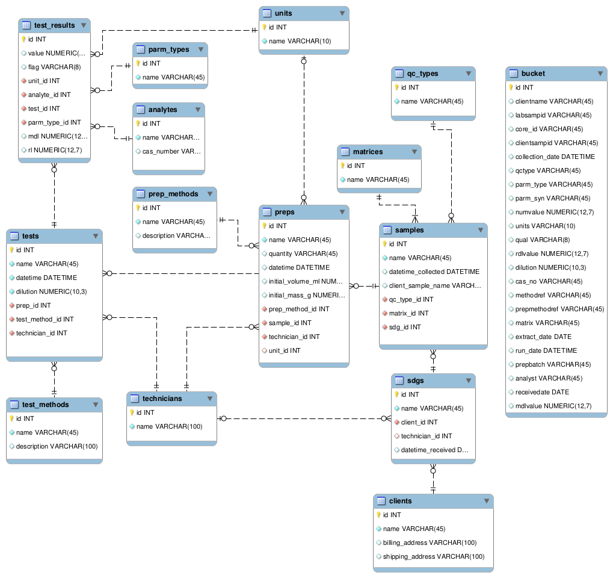
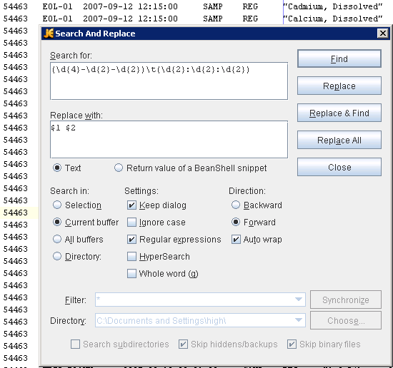
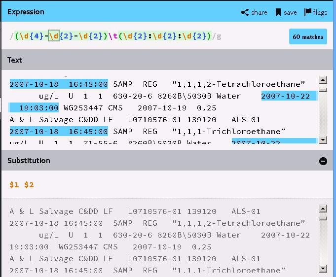
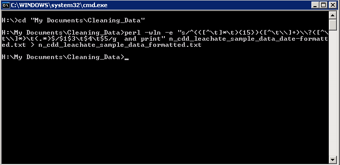
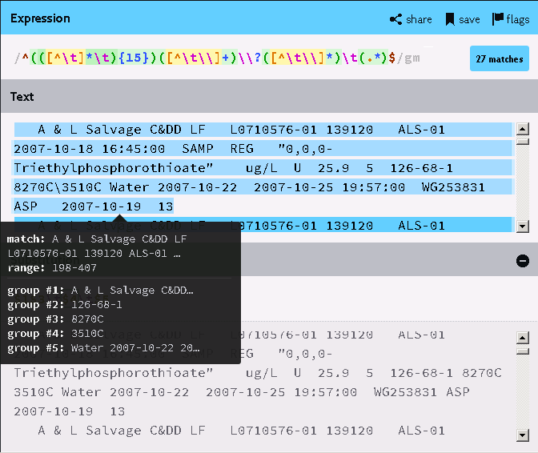

Data Management
========================================================

For Scientific Research

[//]: # (author: Brian High, UW DEOHS)
[//]: # (date: 2014-05-23)
[//]: # (license: CC0 1.0 Universal,linked-content/images)
[//]: # (note: License does not apply to external content such as quoted material, linked web pages, images, or videos. These are licensed separately by their authors, publishers or other copyright holders. See attribution links for details.)
[//]: # (note: Any of the trademarks, service marks, collective marks, design rights, personality rights, or similar rights that are mentioned, used, or cited in the presentations and wiki of the Data Management For Scientific Research workshop/course are the property of their respective owners.)
[//]: # (homepage: https://github.com/brianhigh/data-workshop)

<p style="width: 600px; float: right; clear: right; margin-bottom: 5px; margin-left: 10px; text-align: right; font-weight: bold; font-size: 14pt;">Photo: &copy; <a href="http://www.stanza.co.uk/body/index.html">Stanza</a>. Used with permission.</p>

Data Cleaning
==============================================

When working with external data sources, we often have to spend considerable 
amounts of time and effort to "clean" the data before we can use it.

Some examples of issues that cleaning can address:

* Data value formatting
* Missing values
* Combining or separating columns
* Inconsistent capitalization or spelling
* Linking and combining data sets

Example: Environmental Testing Lab
===========================================

We have already designed a database structure for a sample testing lab.  

This version has been modified to facilitate importing external data.

The large, unlinked table on the right is the "bucket". 

We will use the bucket as temporary, intermediate storage of the imported data.

---



First, we need to clean up the external data.

Some Tools for Data Cleaning
============================================

Today we will import real-world data into that database. But first, we need to download 
and clean the external data.

We will clean the data using various tools:

* Cell Reformatting with Excel (or Libre Office)
* Regular expressions with jEdit
* Regular expressions with Perl 
* SQL commands with MySQL

If you would like to follow along and perform the same steps on your own system, you will need Microsoft Excel (or Libre Office Calc), jEdit (or TextWrangler, etc.), Perl, and MySQL.

Download the Data
===========================================

We will use this Excel (XLS) file:

<p style="width: 700px; float: right; clear: right; margin-bottom: 5px; margin-left: 10px; text-align: right; font-weight: bold; font-size: 14pt;">Data source: <a href="http://www.epa.ohio.gov/portals/34/document/newsPDFs/n_cdd_leachate_sample_data.xls">Ohio EPA</a>. Used with permission.</p>

http://www.epa.ohio.gov/portals/34/document/newsPDFs/n_cdd_leachate_sample_data.xls


Reformat Dates and Times
===========================================

When importing data, MySQL wants to see:

* dates in "yyyy-mm-dd" format
* years in "yyyy" format
* times in "hh:mm:ss" format
* "datetimes" in "yyyy-mm-dd hh:mm:ss" format

A "datetime" is a time-stamp such as would be found in a log file. It combines a date and a time into a single field.


Format Dates in Excel
===========================================

* Reformat the "collectdate" field
  1. Click the "E" column header, the "collectdate" field
  2. Right click, choose "Format Cells"
  3. Choose "Custom", enter this Type: yyyy-mm-dd and press OK
* Do the same for "R", extract_date
* Do the same for "V", receivedate

Note: 

As with all of our Excel examples, you could also do this in Libre Office.

Format Times in Excel
===========================================

* Reformat the "collecttime" field
  1. Click "F" column header, the "collecttime" field
  2. Right click, choose "Format Cells"
  3. Choose "Custom", enter this Type: hh:mm:ss
  4. Press OK

Format DateTimes in Excel
===========================================

Reformat the "run_date" field

  1. Click "S" column header, the "run_date" field
  2. Right click, choose "Format Cells"
  3. Choose "Custom", enter this Type: yyyy-mm-dd hh:mm:ss
  4. Press OK

Add Empty "id" in Excel
===========================================

Before saving the file as text, we will add an empty "id" column to the spreadsheet.

Insert the new column as a new first column (A) of the spreadsheet. Give it a column heading of "id".

This will make it easier to import the data into our "bucket" table, as we will not need to specify our column names at that stage.

---


Save as Tab-Delimited Text File
===========================================

We will use the tab-separated-variable (TSV) format as a simpler alternative to the more well-known (but sometimes problematic) comma-separated-variable (CSV) format.

Using the "File" menu ...

* File ... 
  - Save As ...
    - Save as type: 
      - Text (Tab delimited)(*.txt)
    - File name: 
      - n_cdd_leachate_sample_data_date-formatted.txt
* Press "OK" and "Yes"

Check Fields in jEdit
===========================================

We will use regular expressions to join some fields. You can use any editor or tool which supports Regular Expressions.

* Open the file in jEdit
* Check the date/time formatting made previously

You can you an alternative to jEdit, such as TextWrangler, if you prefer. You will want to use a programmer's text editor with regular expressions support.

Example: Join Fields with jEdit
===========================================

Now do a "search and replace" to join fields.

* Need to join DATE (tab) TIME into one field.
* From the menu: 
  - Search ... Find
* Search for: 

```(\d{4}-\d{2}-\d{2})\t(\d{2}:\d{2}:\d{2}) ```

* Replace with: 

```$1 $2 ```

Remove "collectime" header and the tab which follows it.


Example: Join Fields (jEdit Screenshot)
===========================================



Press "Replace All" to make the changes.

Example: Join Fields (RegExr Screenshot)
===========================================



http://regexr.com/

Example: Split Fields with Perl
============================================

We need to split out "METHOD\METHOD" into two fields.

* Our "Search for" expression: 

```^(([^\t]*\t){15})([^\t\\]+)\\?([^\t\\]*)\t(.*)$ ```

* Our "Replace with" expression:

```$1$3\t$4\t$5 ```

* Run this one-line command at the DOS (CMD) prompt:

```perl -wln -e "s/^(([^\t]*\t){15})([^\t\\]+)\\?([^\t\\]*)\t(.*)$/$1$3\t$4\t$5/g and print" input_file.txt > output_file.txt```

Example: Split Fields (Perl Screenshot)
===========================================



Here, we pasted the Perl command as a single line. In the DOS window, it shows as a wrapped line. 

Notice there is no output visible. That is expected.

Example: Split Fields (RegExr Screenshot)
===========================================



http://regexr.com/

Final Text Edits in jEdit
===========================================

Open the output file in jEdit and...

* Add a new header "prepmethodref" after "methodref"

Also, need to remove all double quote (") characters.

* Search -> Find
* Search for: " (type just the double quote)
* Replace with: (leave this field blank)

We removed all of the quote characters, since they are not needed in this file.

Alternatively, we could use MySQL to remove the quotes from the file as it is imported.

Final Column Check in Excel
===========================================

Make sure columns and headings are lined-up correctly.

If you see any empty columns, remove them. Add any missing column headings, or remove any extra column headings. 

If you made any changes, we sure to Save-As Tab-Delimited Text as you did earlier.

You are now ready to transfer this text file to the MySQL server for importing. Use an SFTP program such as FileZilla.

Create Table "bucket" in MySQL
===========================================


Import Data File into MySQL
===============================================

Since we used a tab-delimited file, the import statement is relatively simple.

```{sql}
LOAD DATA INFILE 
'/Data/sample_data_formatted.txt' 
INTO TABLE bucket 
IGNORE 1 LINES;
```

The one line we are ignoring is the header row.

We can run this from MySQL Workbench or the MySQL command-line client utility.

Data Cleanup with SQL
===============================================

Fill in empty or unknown prep methods with analysis method.

```{sql}
UPDATE `bucket` 
SET `prepmethodref` = `methodref`
WHERE `prepmethodref` = "" 
    OR `prepmethodref` = "METHOD";
```

Make all analysts uppercase since they are just "initials"

```{sql}
UPDATE `bucket` 
SET `analyst` = UCASE(`analyst`);
```

We are now ready to copy the data from the temporary "bucket" to the normalized tables of our database with INSERT INTO statements. We cover this process in the next tutorial.
