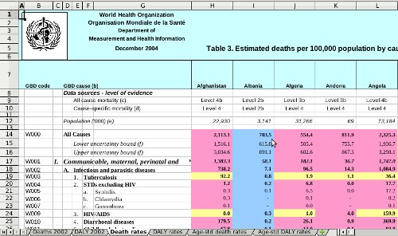
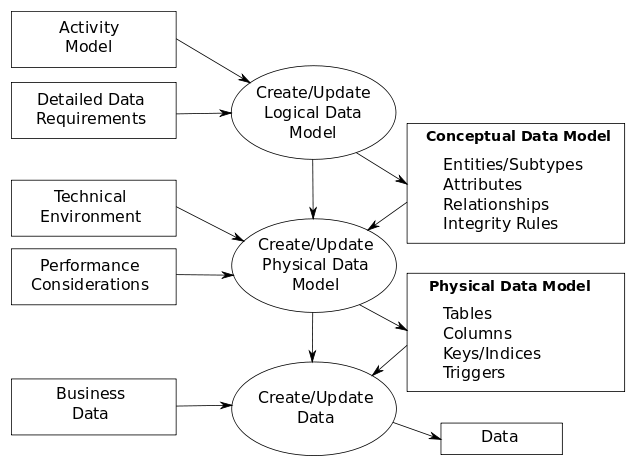
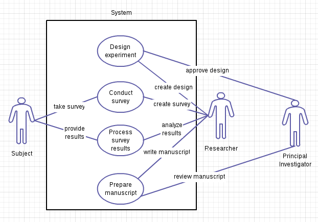
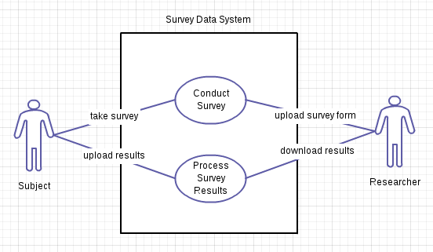

Data Management for Researchers
========================================================
author: Brian High, UW DEOHS
date: 2014-04-03

----

[//]: # (From: http://www.nuxeo.com/blog/industry-insight/2011/10/enterprise-content-trends-2/)

Course Introduction
========================================================

Welcome to a course in data management for scientific research projects.

## Course Structure

* Casual "guided" study-group approach
* Presentations, demos, hands-on exercises, discussions and "homework"
* Materials: A textbook, eBooks, websites, and online videos

Why Take This Course?
========================================================

* Researchers work with increasing amounts of data.
* Many students do not have training in data management.
* Science degree programs generally do not address this gap.
* It is difficult for non-majors to get into IT courses.
* This leaves students and research teams struggling to cope.
* And therefore places a heavy burden on IT support.
* Our data management course provides the needed skills to address these issues.
* Exciting new discoveries await those who can effectively sift through mounds of data!

Participant Introductions
========================================================

## Please introduce yourself and share your:

* Degree program and emphasis
* Research topic (in general)
* Your particular research project
* The types of data or data systems you will be using
* What you hope to get out of this course

[//]: # (From: http://iconsforlife.com/post/28922487778)

Session 1: Data System Essentials
========================================================

[//]: # (From: http://www.stanza.co.uk/body/index.html)
<small>Photo: &copy; [Stanza](stanza.co.uk)</small>
    

Today's Learning Objectives
========================================================

In this session, you will ...

* Become familiar with common types of data systems
* Learn to differentiate between flat files and relational databases
* Learn to differentiate between spreadsheets and databases
* Learn how to model system functions and interactions
* Learn how to create system diagrams

Types of Data Systems
========================================================

### Unlinked

* [Flat file](http://en.wikipedia.org/wiki/Flat_file_database)

---

### Linked

* [Network](http://en.wikipedia.org/wiki/Network_model)
* [Distributed](http://en.wikipedia.org/wiki/Distributed_database)
* [Hierarchical](http://en.wikipedia.org/wiki/Hierarchical_database_model)
* [Relational](http://en.wikipedia.org/wiki/Relational_database)
* [Object relational](http://en.wikipedia.org/wiki/Object-relational_database)
* [NoSQL](http://en.wikipedia.org/wiki/NoSQL)

========================================================

## Flat Files

* MS Office Documents (e.g. DOCX, XLSX)
* Plain Text Files (e.g. CSV, TXT)
* Output files from instruments (various formats)
* Output files from stats programs (e.g. SAS7BDAT)

## Relational Databases

* MS Access
* FileMaker Pro
* SQLite
* MS SQL Server
* Oracle
* MySQL
* PostgreSQL

Databases versus Spreadsheets
========================================================

An excellent short video presentation explaining the differences between databases and spreadsheets can be found on YouTube: 

* Video: [What are databases?](https://www.youtube.com/watch?v=Ls_LzOZ7x0c) - lynda.com

Watching this video is a "homework" assignment!

[//]: # (From: http://www.differencebetween.net/technology/difference-between-spreadsheet-and-database/)

So for now, we will just summarize these differences ...

Spreadsheets
========================================================

* Convenient
* Interactive
* Visual
* Flexible
* Portable

---

[//]: # (From: http://www.softicons.com/web-icons/large-calendar-icons-by-aha-soft/spreadsheet-icon)

Databases
========================================================

* Manageable
* Organized
* Standardized
* Scalable
* Accessible

---

[//]: # (From: http://code.tutsplus.com/tutorials/relational-databases-for-dummies--net-30244)

Designing a Data System
========================================================

To design a data system, we need to identify requirements and map out the various system components. In this course we will learn how to create:

* Use Case Diagrams
* Data Flow Diagrams
* Entity Relationship Diagrams

So let's get started!

---

[//]: # (From: http://en.wikipedia.org/wiki/Data_modeling)

Get the Picture: Use Case Diagrams
========================================================

Let's visualize a model of a "system" ...

[Use Case Diagrams](http://en.wikipedia.org/wiki/Use_Case_Diagram) focus on the "what" and not the "how". 

They model what people want to do with a system. A use case describes a "goal", expressed as an "action". People and other external entities are modeled as "actors" that "interact" with the system.

---

[//]: # (From: http://en.wikipedia.org/wiki/Use_Case_Diagram)

Example System Interactions
========================================================

Imagine a system called "research project." Some interactions that might appear in a model of this system are:

1. Researcher proposes experimental design.
2. Principal investigator approves experimental design.
3. Researcher creates survey.
4. Subject takes survey.
5. Subject provides survey results.
6. Researcher analyses results.
7. Researcher produces manuscript.
8. Principal investigator reviews manuscript.

Let's visualize these interactions in a use case diagram...

Research Project Use Case Diagram
========================================================

If we were only modeling the data system, we would probably remove the goals (and some actors) which were "out of scope" with repect to  the data system...

Survey Data System Use Case Diagram
========================================================

Here, the scope only encompasses the goals of conducting the survey and returning results.

---

1. Researcher uploads survey.
2. Subject takes survey.
3. Subject uploads results.
4. Researcher downloads results.

This is the basic operation of the [Open Data Kit](http://opendatakit.org/) system which we will learn about next week.

But what good are they, really?
========================================================

 Modeling diagrams help you:

* Clarify your own understanding
* Explore possibilities
* Communicate with others
* Prepare for more detailed design steps

As a researcher, you can use these to clarify your project scope and requirements. They will help you present your project needs to others, such as your collaborators and support staff.

Use case diagrams identify what a system must do and how people will interact with it. Developers use them to design user interfaces and tests for software, such as database applications.

Hands-on Group Exercise
========================================================

As a group, list of the ways that you and others will accomplish research goals with your own data system. 

List goals as actions in "verb noun" form. Then figure out who interacts to perform those actions.

[//]: # (From: http://commons.wikimedia.org/wiki/File:Group_visioning_session_-_group_one_-_Stierch.jpg)

---

Draw a simple use case diagram with stick figures (actors) and elipses (goals, or use cases). 

All of the elipses should be enclosed in a "system boundary" box, with the stick figures outside of the box. 

Lines (interactions) should connect the actors to their goals (use cases). Label the lines with what the actor does (action) to achieve the goal. 

Discussion
========================================================

We will display your diagrams on the screen and discuss them.

[//]: # (From: http://commons.wikimedia.org/wiki/File:User_journey_discussion.png)

Action Items
========================================================

###  Tasks 
[//]: # (From: http://www.flaticon.com/free-icon/checklist-square-interface-symbol-of-rounded-corners_39862)
[//]: # (Icon made by Freepik from Flaticon.com)

###  Readings 
[//]: # (From: http://iconsforlife.com/post/27700442282)

###  Videos 
[//]: # (From: http://www.iconsdb.com/black-icons/video-play-3-icon.html)
[//]: # (This icon is provided as CC0 1.0 Universal (CC0 1.0) Public Domain Dedication.)

Tasks
========================================================

We have several tasks to perform as "homework" before our next session. They should be fairly quick to complete. You might do one task per day, spending maybe 15-30 minutes on each task.

Task 1: Your favorite website's database
========================================================

Find out through Internet research what database system (product name, database type, etc.) underlies your favorite or most-visited website. Examples might be a webmail, search, social, video/movie/music/store, blog, forum, or news website. (Since there are links to information about this on Facebook below, pick another site if that was your favorite.) 

If the site is popular, you will likely find a blog, news article or conference presentation mentioning the technology that the site uses, including it's back-end database system. Look up the database system product name in Wikipedia. Try to determine why that product was chosen over the other alternatives. Be ready to share this information in the next class session in a one-minute verbal presentation.

Task 2: Limits to Excel as a "database"
========================================================

Find out the actual limits on MS Excel (max. file size, number of rows, etc.) that would make it unusable as a database if those limits were exceeded. (These may vary depending on the software version.) How about for OpenOffice (LibreOffice) "Calc"?

For the Excel experts (bonus points): How do you link spreadsheets by matching columns headings, control the allowed values which can be entered in a column, protect cells (say, those containing formulas or constants) from being changed, restrict who can modify or view certain spreadsheets, and access the linked spreadsheets from other applications (like websites or statistics programs) over a network? If you know how to do these things, please demonstrate in class for us.

Task 3: Document data sources in a wiki
========================================================

Use your wiki in Redmine (or GitHub) to document the list of the data sources you will be working with in your project. Note the file types/applications, organizations/persons/processes they came from, and what you will do to/with them. 

Estimate how much storage space your project will consume (megabytes, gigabytes?), how you will need to access your data (from campus, remotely, from a mobile device, using what software?) and what sorts of security protections you will need. 

The wiki language supports tables, which might be a good way to format the information in the wiki. Later you will use this wiki to further elucidate your "data dictionary". Summarize this in the next session (1 minute presentation).

Task 3: Use case diagram for your project
========================================================

Produce a Use Case Diagram for your research study data system. Make it more detailed than the one we made in class today. 

Include all of the data-related tasks associated with your research project from beginning to end. The "audience" for this diagram should be IT staff who will help you develop the data system. Therefore, go into a level of detail which would communicate your data system needs clearly to a IT professional (analyst, designer, developer, or administrator).

You can use pen and paper to make the diagram or you can use software tools such as Creately, Gliffy, Dia, Visio. You will present this diagram (for one or two minutes) in the next class session.

Task 5: Get files for textbook exercises
========================================================

Download [Examples from the textbook](http://practicalcomputing.org/files/pcfb_examples.zip) and extract the example files from the "pcfb_examples.zip" file to the folder "pcfb". Put that folder in whichever environment you will be working. For now, this will probably be your "Documents" folder on your own computer or in your "home directory" on Plasmid. (We will discuss how to transfer files to and from Plasmid in class.)

Readings
========================================================
* Read:  In the PCfB textbook: "Before You Begin", pp. 1-6; Chapters 1-3, pp. 9-43; and Appendix 1, pp. 451-453 (for Windows and Linux users only). Work through the examples on your own computer (or Plasmid).
* Skim: [Data Management (Wikipedia)](http://en.wikipedia.org/wiki/Data_management)
* Skim: [Data System (Wikipedia)](http://en.wikipedia.org/wiki/Data_system)
* Skim: [Data Modeling (Wikipedia)](http://en.wikipedia.org/wiki/Data_modeling)
* Skim: [UML Requirements Modeling For Business Analysts](http://seattle.bibliocommons.com/item/show/2861156030_uml_requirements_modeling_for_business_analysts) Chapter 5: Use Case Models
* Explore: [ODK Website](http://opendatakit.org/)

Watch Videos
========================================================

* [Use Case Diagram Videos](https://www.youtube.com/playlist?list=PL05DE2D2EDDEA8D68) (playlist: watch first two or more)
* [What are databases?](https://www.youtube.com/watch?v=Ls_LzOZ7x0c)
* [ODK](https://www.youtube.com/user/odkteam/videos?shelf_id=1&sort=dd&view=0) (watch one or two)

See also 
========================================================

* [Google and Facebook Team Up to Modernize Old-School Databases](http://www.wired.com/wiredenterprise/2014/03/webscalesql/)
* [WebScaleSQL: MySQL for Facebook-sized databases](http://www.zdnet.com/webscalesql-mysql-for-facebook-sized-databases-7000027814/)
* [What database actually FACEBOOK uses?](http://www.techworm.net/2013/05/what-database-actually-facebook-uses.html)
* [What database does Facebook use?](http://www.prodromus.com/2011/01/27/what-database-does-facebook-use)
* [NYT: Healthcare.gov Project Chaos Due Partly To Unorthodox Database Choice (Slashdot)](http://developers.slashdot.org/story/13/11/24/1437203/nyt-healthcaregov-project-chaos-due-partly-to-unorthodox-database-choice)
* [What are databases? Video](https://www.youtube.com/watch?v=Ls_LzOZ7x0c)
* [Use Case Diagram Videos](https://www.youtube.com/playlist?list=PL05DE2D2EDDEA8D68)
* [Topics in Data Management](http://en.wikipedia.org/wiki/Data_management#Topics_in_Data_Management)
* [*That* information, *These* data?](http://en.wikipedia.org/wiki/Data#Usage_in_English)
* [Is "Data" Singular or Plural?](http://www.quickanddirtytips.com/education/grammar/is-data-singular-or-plural?page=all)

Some Parting Words
========================================================

> It is estimated that 40% of the defects that make it into the testing phase of enterprise software have their root cause in errors in the original requirements documents.

From: [Obamacare's Website Is Crashing Because Backend Was Doomed In The Requirements Stage (Forbes)](http://www.forbes.com/sites/anthonykosner/2013/10/21/obamacares-website-is-crashing-because-backend-was-doomed-in-the-requirements-stage/)

---

