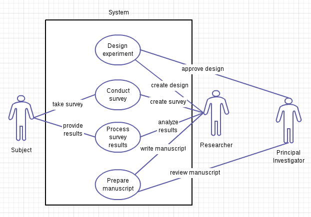

Data Management for Researchers
========================================================
author: Brian High, UW DEOHS
date: 2014-04-03

----

Course Introduction
========================================================

Welcome to a course in data management for scientific research projects.

## Course Structure

* Meet once a week for ten weeks
* Casual "guided" study-group approach
* Presentations, demos, hands-on exercises, discussions and "homework"
* Materials: A textbook, eBooks, websites, and online videos

Participant Introductions
========================================================

## Please introduce yourself and share your:

* Degree program and emphasis
* Research topic (in general)
* Your particular research project
* The types of data or data systems you will be using
* What you hope to get out of this course

---

Session 1: Data System Essentials
========================================================

Types of Data Systems
========================================================

* Flat file
* Network
* Distributed
* Hierarchical
* Relational
* Object relational
* NoSQL

Want to know more? See: [Database Models](http://unixspace.com/context/databases.html).

========================================================

## Flat Files

* MS Office Documents (e.g. DOCX, XLSX)
* Plain Text Files (e.g. CSV, TXT)
* Output files from instruments (various formats)
* Output files from stats programs (e.g. SAS7BDAT)

## Relational Databases

* MS Access
* FileMaker Pro
* SQLite
* MS SQL Server
* Oracle
* MySQL
* PostgreSQL

Databases versus Spreadsheets
========================================================

An excellent short video presentation explaining the differences: 

* [What are databases?](https://www.youtube.com/watch?v=Ls_LzOZ7x0c)

Watching this video will be a "homework"" assignment. (More about those will come later...)

Spreadsheets
========================================================

* Convenient
* Interactive
* Visual
* Flexible
* Portable

---

Databases
========================================================

* Manageable
* Organized
* Standardized
* Scalable
* Accessible

---

Designing a Data System
========================================================

To design a data system, we need to map out the various system components. In this course we will learn how to create:

* Use Case Diagrams
* Data Flow Diagrams
* Entity Relationship Diagrams

So let's get started!

---

Hands-on Group Exercise
========================================================

Let's visualize a model of a "system" ...

Get the Picture: Use Case Diagrams
========================================================

[Use Case Diagrams (Wikipedia)](http://en.wikipedia.org/wiki/Use_Case_Diagram) focus on the "what" and not the "how".

### Exercise:

Working as a group, make a list of the ways that you and other "actors" will interact through "actions" with your research data system. Draw a simple use case diagram with stick figures (actors) and circles (actions). All of the circles should be enclosed in a "system boundary" box, with the stick figures outside of the box. Lines should connect the actors to their actions. Label the lines with what the actor does to participate in the action. 

Example System Interactions
========================================================

Some example system interactions that might appear in a (rather contrived) use case diagram for a research project: 

1. Researcher proposes experimental design.
2. Principal investigator approves experimental design.
3. Researcher creates survey.
4. Subject takes survey.
5. Subject provides survey results.
6. Researcher analyses results.
7. Researcher produces manuscript.
8. Principal investigator reviews manuscript.

Example Use Case Diagram
========================================================

But what are they for?
========================================================

Use case diagrams can be used to develop a data system. Specifically, they are used to identify what a system must do. For example they can be used to design user interfaces and tests for software, such as database applications.

## Discussion

We will display your diagrams on the screen and discuss them.

Action Items (tasks, readings, and videos)
========================================================

Tasks
========================================================

We have several tasks to perform as "homework" before our next session. They should be fairly quick to complete. You might do one task per day, spending maybe 15-30 minutes on each task.

Database behind your favorite website
========================================================

Find out through Internet research what database system (product name, database type, etc.) underlies your favorite or most-visited website. Examples might be a webmail, search, social, video/movie/music/store, blog, forum, or news website. (Since there are links to information about this on Facebook below, pick another site if that was your favorite.) If the site is popular, you will likely find a blog, news article or conference presentation mentioning the technology that the site uses, including it's back-end database system. Look up the database system product name in Wikipedia. Try to determine why that product was chosen over the other alternatives. Be ready to share this information in the next class session in a one-minute verbal presentation.

Limits to Excel as a database
========================================================

Find out the actual limits on MS Excel (max. file size, number of rows, etc.) that would make it unusable as a database if those limits were exceeded. For the Excel experts (bonus points): How do you link spreadsheets by matching columns, control the allowed values which can be entered in a column, protect cells (say,those containing formulas or constants) from being changed, restrict who can modify or view certain spreadsheets, and access the linked spreadsheets from other applications (like websites or statistics programs) over a network?

Use case diagram for your project
========================================================

Produce a Use Case Diagram for your research study data system. Make it more detailed than the one we made in class today. Include all of the data-related tasks associated with your research project from beginning to end. You can use a pen and paper to make the diagram or you can use software such as Creately, Gliffy, Dia, or Visio. You will present this diagram (for one minute) in the next class session.

Document your data sources in a wiki
========================================================

Use your wiki in Redmine (or GitHub) to document the list of the data sources you will be working with in your project. Note the file names and locations, file types/applications, organizations/persons/processes they came from, and what you will use them for (i.e. what you will do to/with them). Estimate how much storage space your project will consume (megabytes, gigabytes?), how you will need to access your data (from campus, from off campus, from a mobile device, using what software?) and what sorts of security protections you will need (human subject identifiers?). The wiki language supports tables, which might be a good way to format the information in the wiki. Otherwise section headings and lists might work okay too. Later you will use this wiki to further elucidate your "data dictionary". Be ready to verbally summarize this in the next session (1 minute presentation).

Get example files for textbook exercises
========================================================

Download [Examples from the textbook](http://practicalcomputing.org/files/pcfb_examples.zip) and extract the example files from the "pcfb_examples.zip" file to the folder "pcfb". Put that folder in whichever environment you will be working. For now, this will probably be your "Documents" folder on your own computer or in your "home directory" on Plasmid. (We will discuss how to transfer files to and from Plasmid in class.)

Readings
========================================================
* Read:  In the PCfB textbook: "Before You Begin", pp. 1-6; Chapters 1-3, pp. 9-43; and Appendix 1, pp. 451-453 (for Windows and Linux users only). Work through the examples on your own computer (or Plasmid).
* Skim: [Data Management (Wikipedia)](http://en.wikipedia.org/wiki/Data_management)
* Skim: [Data System (Wikipedia)](http://en.wikipedia.org/wiki/Data_system)
* Explore: [ODK](http://opendatakit.org/)

Watch Videos
========================================================

* [What are databases?](https://www.youtube.com/watch?v=Ls_LzOZ7x0c)
* [ODK](https://www.youtube.com/user/odkteam/videos?shelf_id=1&sort=dd&view=0) (watch one or two)
* [Google Fusion Tables Examples](https://www.youtube.com/results?search_query=%22fusion+tables%22+example&sm=3) (watch one or two, optional)

See also 
========================================================

* [Google and Facebook Team Up to Modernize Old-School Databases](http://www.wired.com/wiredenterprise/2014/03/webscalesql/)
* [WebScaleSQL: MySQL for Facebook-sized databases](http://www.zdnet.com/webscalesql-mysql-for-facebook-sized-databases-7000027814/)
* [What database actually FACEBOOK uses?](http://www.techworm.net/2013/05/what-database-actually-facebook-uses.html)
* [What database does Facebook use?](http://www.prodromus.com/2011/01/27/what-database-does-facebook-use)
* [NYT: Healthcare.gov Project Chaos Due Partly To Unorthodox Database Choice (Slashdot)](http://developers.slashdot.org/story/13/11/24/1437203/nyt-healthcaregov-project-chaos-due-partly-to-unorthodox-database-choice)
* [DailyViz Fusion Tables Examples](http://thedailyviz.com/tag/google-fusion-tables/)
* [Google Fusion Table map visualization tutorial Video](https://www.youtube.com/watch?v=ok7gz4nAnFE)
* [Google Fusion Tables Tutorial With Circle of Blue Video](https://www.youtube.com/watch?v=p0xnk9zFQpY)
* [What are databases? Video](https://www.youtube.com/watch?v=Ls_LzOZ7x0c)
* [Topics in Data Management](http://en.wikipedia.org/wiki/Data_management#Topics_in_Data_Management)
* [*That* information, *These* data?](http://en.wikipedia.org/wiki/Data#Usage_in_English)
* [Is "Data" Singular or Plural?](http://www.quickanddirtytips.com/education/grammar/is-data-singular-or-plural?page=all)

Parting Words
========================================================

> It is estimated that 40% of the defects that make it into the testing phase of enterprise software have their root cause in errors in the original requirements documents.

From: [Obamacare's Website Is Crashing Because Backend Was Doomed In The Requirements Stage (Forbes)](http://www.forbes.com/sites/anthonykosner/2013/10/21/obamacares-website-is-crashing-because-backend-was-doomed-in-the-requirements-stage/)

---

