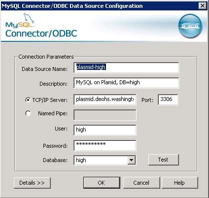
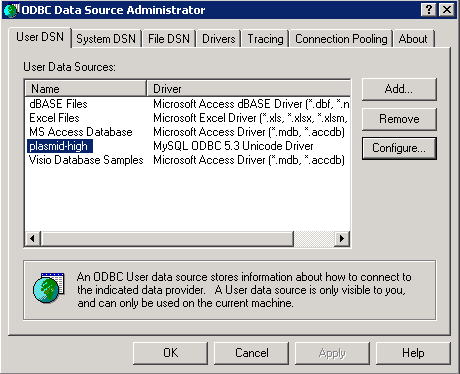
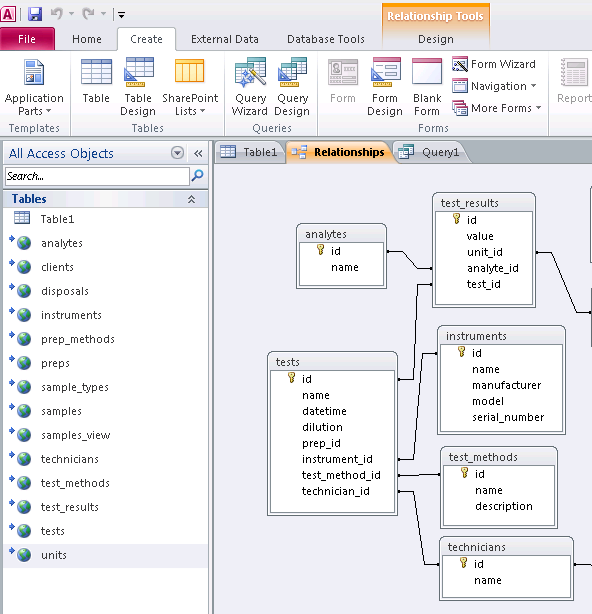
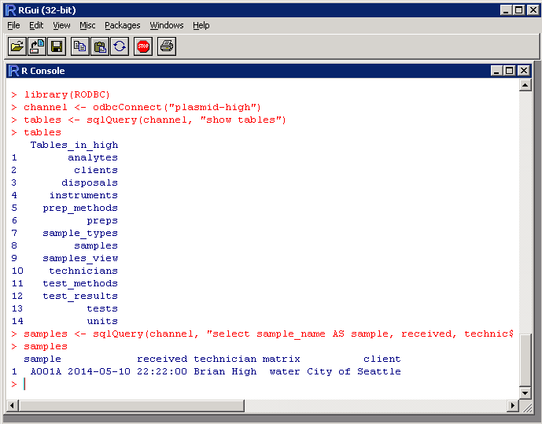
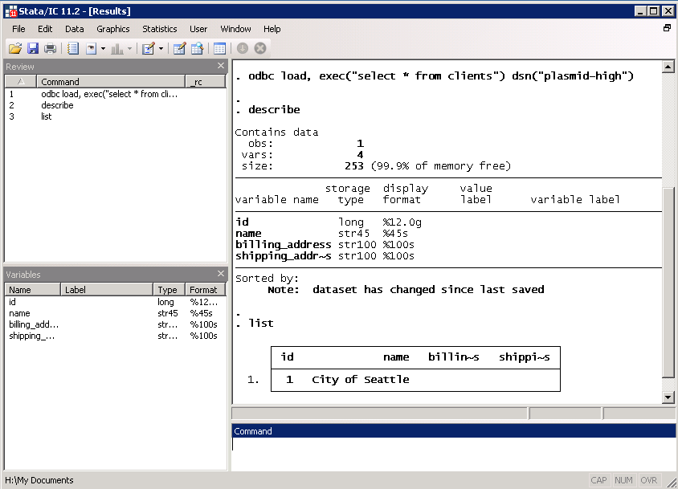
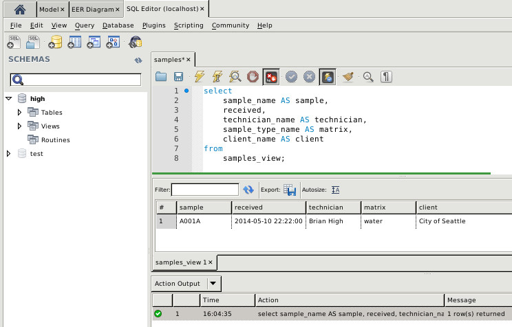
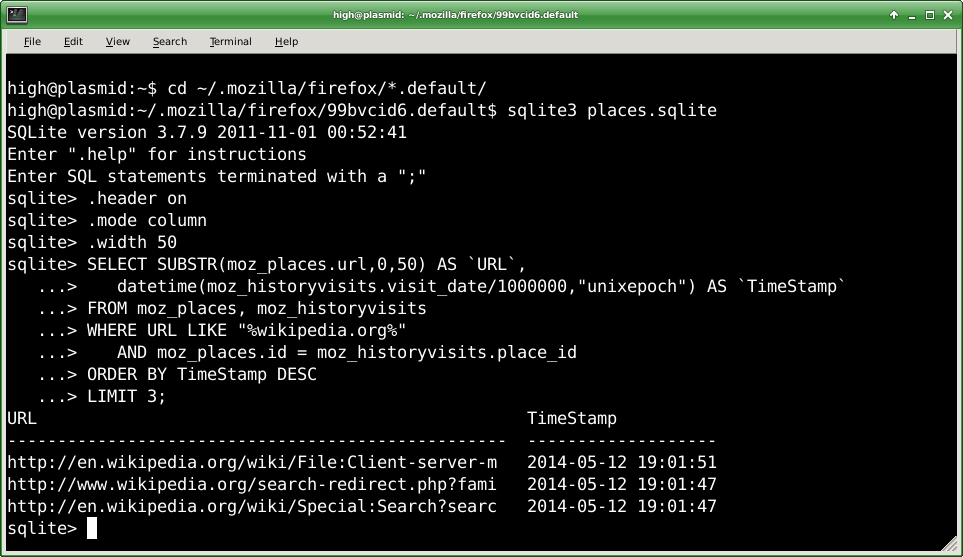
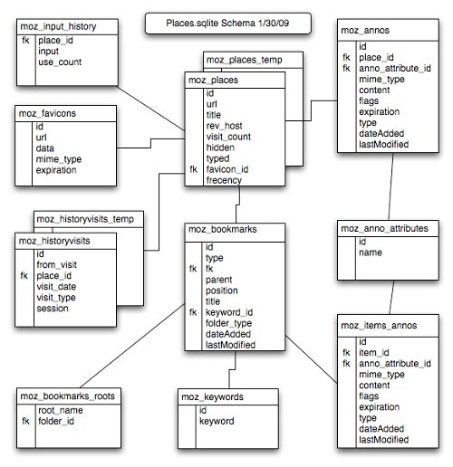
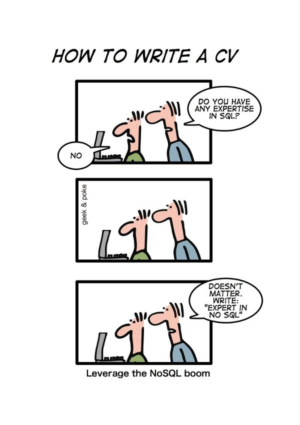

Data Management
========================================================

For Scientific Research

[//]: # (author: Brian High, UW DEOHS)
[//]: # (date: 2014-05-13)
[//]: # (license: CC0 1.0 Universal,linked-content/images)
[//]: # (note: License does not apply to external content such as quoted material, linked web pages, images, or videos. These are licensed separately by their authors, publishers or other copyright holders. See attribution links for details.)
[//]: # (note: Any of the trademarks, service marks, collective marks, design rights, personality rights, or similar rights that are mentioned, used, or cited in the presentations and wiki of the Data Management For Scientific Research workshop/course are the property of their respective owners.)
[//]: # (homepage: https://github.com/brianhigh/data-workshop)

Photo: &copy; <a href="http://www.stanza.co.uk/body/index.html">Stanza</a>. Used with permission.

Session 6: Database Applications and SQL
========================================================

Today we will be discussing two types of database applications: servers and clients.

We will also introduce a smattering of SQL in our examples.

---

Image: <a href="http://commons.wikimedia.org/wiki/File:Client-server-model.svg">Seahen / Ch.Andrew / David Vignoni / Wikimedia</a>

Database Servers
========================================================

Three popular types of database servers are:

* Relational (usually SQL)
* NoSQL ("Not only SQL")
* Object-Relational

SQL = "Structured Query Language"

SQL Servers
========================================================

SQL servers are the most common type of database server. 

Some popular SQL server products are:

* MySQL
* PostgreSQL
* Microsoft SQL
* Oracle

Database Clients
========================================================

We consider any end-user application that can connect to a database server as a database "client". 

Examples include:

* Various web applications and frameworks
* Desktop Applications and Mobile Apps
* Data analysis tools and statistics packages
* Scripts and programs and their database libraries

Database Connections
========================================================

There are three main ways to connect to a database:

* File-based access (SQLite, MDB, CSV)
* Connection to SQL service using "native" client
* [ODBC](http://en.wikipedia.org/wiki/Open_Database_Connectivity)  (Open Database Connectivity)
  - Using a [DSN](http://en.wikipedia.org/wiki/Data_source_name) (Data Source Name)
  - Using a [connection string](http://en.wikipedia.org/wiki/Connection_string) ("DSN-less")

ODBC (Open Database Connectivity)
========================================================

* Standard interface to DBs.
* Connect to DB with a DSN.
* DSN = "Data Source Name"
* Requires driver (connector)
* Driver is specific to:
  - 32 bit vs. 64 bit
  - DB server product

---

Hands-on Group Exercise
========================================================

Create a DSN for accessing your SQL database from a Windows PC.

For our exercise, we will connect from the student server.

Create a "user DSN" using the MySQL Unicode Driver.

Go to "Administrative Tools" -> Data Sources (ODBC).

---

Under the "User DSN" tab click "Add".

Using MS-Access with a SQL Database
========================================================

From MS-Access, you can link to tables and views from a SQL server.

* Connect DB with a DSN
* Link to DB tables
* Recreate relationships
* Create views, forms, and reports

---

Using SQL in R
========================================================

We can use the same DSN to connect with R.

Using SQL in Stata
========================================================

And we can use the same DSN to connect with Stata.

Using SQL in MySQL Workbench
========================================================

MySQL WB can connect to the server without needing a DSN.

SQLite Example: Firefox History
========================================================

File-based access does not need a DSN or connection string.

SQL Queries in a Nutshell
========================================================

SQL (Structured Query Language) is a language for working with relational databases.

The most common SQL command is a SELECT statement.

Some example queries using SELECT:

* SELECT * FROM table1;
* SELECT column1, column2 FROM table1;
* SELECT * FROM table1 WHERE column1 = "Joe";
* SELECT * FROM table1 ORDER BY column2, column1 ASC;

You can combine WHERE, ORDER BY, and other clauses.

Hands-on Group Exercise
========================================================

Take a look at your own Firefox history database.

* .header on
* .mode column
* .width 50
* .help
* .tables
* SELECT host, frecency 
  FROM moz_hosts 
  ORDER BY frecency DESC 
  LIMIT 5;
* .quit

---

Graphic: <a href="https://developer.mozilla.org/en-US/docs/The_Places_database">Mozilla/dietrich</a>

Discussion
========================================================

We will discuss your SQL queries.

Graphic: <a href="http://upload.wikimedia.org/wikipedia/commons/e/eb/User_journey_discussion.png">Jagbirlehl / Wikimedia</a>

In the Coming Sessions...
========================================================

* Web Applications and Frameworks
* Importing and Exporting SQL Tables
* Using SQL from Another Language
* Project Management and Version Control

Action Items (videos, readings,  and tasks)
========================================================

<table>
   <tr border=0>
      <td width="128" valign="middle">
      </td>
      <td valign="middle">
         <ul>
            <li><a href="http://www.youtube.com/watch?v=tnhJa_zYNVY">MySQL WB Imports</a>
            <li><a href="https://www.youtube.com/watch?v=K3GZidOwGmM">How to Set ODBC MySQL Driver</a>
            <li><a href="https://www.youtube.com/watch?v=F06hvR6ksh4">How to Open MySQL Database With MS Access</a>
            <li><a href="https://www.youtube.com/playlist?list=PLS1QulWo1RIahlYDqHWZb81qsKgEvPiHn">MYSQL Tutorial for beginner (playlist)</a>
         </ul>
      </td>
   </tr>
   <tr>
      <td width="128" valign="middle">
      </td>
      <td valign="middle">
         <ul>
            <li><A href="http://practicalcomputing.org/about">PCfB</a> textbook: Appendix 7 (SQL) and Chapter 16 (Advanced Shell)
            <li>Skim: <a href="http://seattle.bibliocommons.com/item/show/2897906030_sams_teach_yourself_sql_in_10_minutes,_fourth_edition">SAMS Teach Yourself SQL on 10 Minutes</a>: Ch. 5-8, 15-18
            <li>Optional- Skim: <a href="http://www.amazon.com/dp/0123747309">RDDaI3CE</a> textbook: Chapter 9
            <li>Optional- Skim: <a href="http://www.amazon.com/dp/0123756979">SQLCE3</a> textbook: Chapters 3-4
         </ul>
      </td>
   </tr>
   <tr>
      <td width="128" valign="middle"></td>
      <td valign="middle">
         <ul>
            <li>Add some test data to your tables.
            <li>Connect to your database from another program.
            <li>Try all query types you know about so far.
            <li>If you have some external data, try importing it.
         </ul>
      </td>
   </tr>
</table>

See Also
========================================================

* [Stata ODBC](http://www.stata.com/help.cgi?odbc)
* [SAS/ACCESS ODBC with MySQL](http://benjithian.sg/2012/11/sasaccess-odbc-with-mysql/)
* [Using Microsoft Access as a Front-end to MySQL](https://dev.mysql.com/doc/connector-odbc/en/connector-odbc-examples-tools-with-access-linked-tables.html)
* [SQL Tutorial and online practice tool](http://www.w3schools.com/sql/)
* [SQL for Dummies Cheat Sheet](http://goo.gl/vjU9lf)
* [INNER and OUTER JOIN Queries](http://sqlite.awardspace.info/syntax/sqlitepg06.htm)
* [A Visual Explanation of SQL Joins - by Jeff Atwood](http://blog.codinghorror.com/a-visual-explanation-of-sql-joins/)
* [Visual Representation of SQL Joins - By C.L. Moffatt](http://www.codeproject.com/Articles/33052/Visual-Representation-of-SQL-Joins)
* [Firefox History Sqlite DB](http://www.alekz.net/archives/740)
* [Cruft](http://en.wikipedia.org/wiki/Cruft)

Questions and Comments 
========================================================

Image: <a href=http://commons.wikimedia.org/wiki/File:Happy_Question.svg">© Nevit Dilmen</a> / Wikimedia

Some Parting Words
========================================================

Image: <a href="http://geek-and-poke.com/">Geek and Poke</a>. Used with permission.

