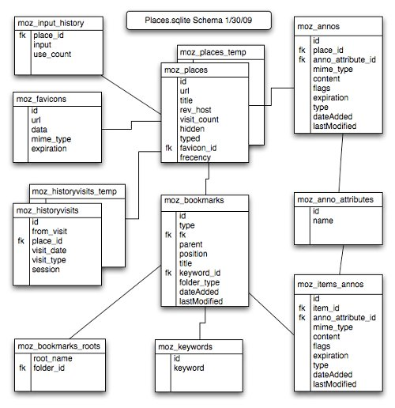
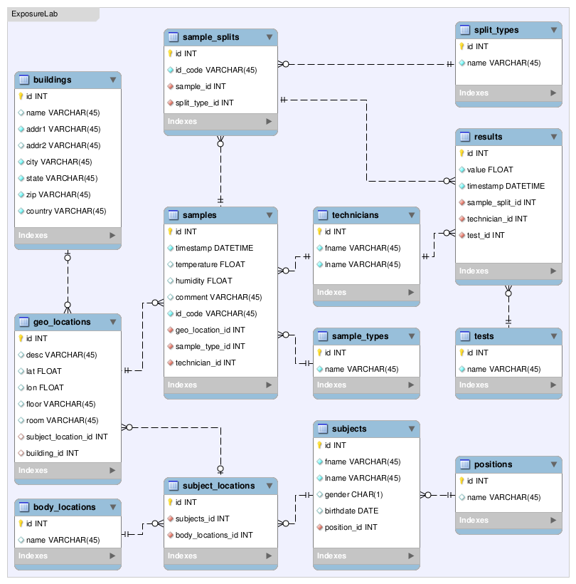

Data Management
========================================================

For Scientific Research

[//]: # (author: Brian High, UW DEOHS)
[//]: # (date: 2014-04-17)
[//]: # (license: CC0 1.0 Universal, linked-content/images)
[//]: # (note: License does not apply to external content such as quoted material, linked web pages, images, or videos. These are licensed separately by their authors, publishers or other copyright holders. See attribution links for details.)
[//]: # (note: Any of the trademarks, service marks, collective marks, design rights, personality rights, or similar rights that are mentioned, used, or cited in the presentations and wiki of the Data Management For Scientific Research workshop/course are the property of their respective owners.)
[//]: # (homepage: https://github.com/brianhigh/data-workshop)

Photo: &copy; <a href="http://www.stanza.co.uk/body/index.html">Stanza</a>. Used with permission.

Systems Development Life Cycle (SDLC)
==================================

One of several approaches to systems development is the [SDLC](http://en.wikipedia.org/wiki/Systems_development_life_cycle), also called the "Waterfall" model.

Image: <a href="http://commons.wikimedia.org/wiki/File:Waterfall_model.svg">Peter Kemp / Paul Smith / Wikimedia</a>

========================================================

Image: <a href="http://mariovalle.name/sdm/scientific-data-management.html">Mario Valle</a>. Used with permission.

========================================================

Image: <a href="http://mariovalle.name/sdm/scientific-data-management.html">Mario Valle</a>. Used with permission.

Session 3: Introduction to Relational Databases
========================================================

Image: <a href="http://en.wikipedia.org/wiki/File:Erd-entity-relationship-example1.svg">Wikimedia</a>

Image: <a href="http://commons.wikimedia.org/wiki/File:CPT-Databases-ExampleReceipt.svg">Wikimedia</a>

Relational Databases
========================================================

A relational database ...

* Is based on the relational model developed by <a href="http://en.wikipedia.org/wiki/Codd%27s_12_rules">E.F. Codd</a>
* Allows the definition of ...
  - data structures
  - storage and retrieval operations
  - integrity constraints

In such a database, the data and relations between them are organized into tables. 

*Source*: <a href="http://databasemanagement.wikia.com/wiki/Relational_Database_Model">Wikia.com</a>

Relational Database Terms
========================================================

Here is a comparison of three sets of terms commonly used with relational databases.

| Table | Row | Column |
| ----- | --- | ------ |
| Relation | Tuple | Attribute |
| File | Record | Field |

---

Image: <a href="http://en.wikipedia.org/wiki/File:Relational_database_terms.svg">Wikimedia</a>

Image: <a href="http://www.pythonlearn.com/html-008/cfbook015.html">Charles Severance</a>

Relations (Tables)
========================================================

A <a href="http://en.wikipedia.org/wiki/Relation_%28database%29">relation</a> is a table organized by rows and columns, according to these rules:

1. Rows represent a unique instance of an entity.
2. Uniquely-named columns are the attributes of an entity.
3. Cells only hold a single value.
4. All cells in a column hold values of the same data type.

Relational Model in Action
========================================================

Example: 

Given an *Activity* table and *Event* table, find all events of the "Overlay" activity.

1. Find code for "Overlay".
2. "Overlay" has a code of 24.
3. Find dates with code = 24.
4. Two dates have code = 24.

---

Image: <a href="http://en.wikipedia.org/wiki/File:Relational_Model.svg">Wikimedia</a>

Entity-Relationship Diagrams
========================================================

For a Data Model, ERDs present ...

* <A href="http://en.wikipedia.org/wiki/Entity">Entities</a>
* <a href="http://en.wikipedia.org/wiki/Entity%E2%80%93relationship_model#Relationships.2C_roles_and_cardinalities">Relationships</a>
* <A href="http://en.wikipedia.org/wiki/Database_constraints">Constraints</a>
* <a href="http://en.wikipedia.org/wiki/Cardinality_%28data_modeling%29">Cardinality</a>
* <a href="http://en.wikipedia.org/wiki/Attribute_%28computing%29">Attributes</a>
* <a href="http://en.wikipedia.org/wiki/Data_domain">Attribute Types</a>
* <a href="http://en.wikipedia.org/wiki/Primary_keys">Keys</a>

---

Graphic: <a href="https://developer.mozilla.org/en-US/docs/The_Places_database">Mozilla/dietrich</a>

ER Diagram Symbols
========================================================

Image: <a href="http://en.wikipedia.org/wiki/File:ERD_Representation.svg">Wikimedia</a>

Conceptual Data Model ERD
========================================================

Shows:

* <A href="http://en.wikipedia.org/wiki/Entity">Entities</a>
* <a href="http://en.wikipedia.org/wiki/Entity%E2%80%93relationship_model#Relationships.2C_roles_and_cardinalities">Relationships</a>

May also show:

* <A href="http://en.wikipedia.org/wiki/Database_constraints">Constraints</a>
* <a href="http://en.wikipedia.org/wiki/Cardinality_%28data_modeling%29">Cardinality</a>

---

Image: <a href="http://en.wikipedia.org/wiki/File:Erd-entity-relationship-example1.svg">Wikimedia</a>

Uses:

* Common language of the business or field
* For non-technical or higher-level stakeholders

Logical Data Model ERD
========================================================

Shows:

* <A href="http://en.wikipedia.org/wiki/Entity">Entities</a>
* <a href="http://en.wikipedia.org/wiki/Entity%E2%80%93relationship_model#Relationships.2C_roles_and_cardinalities">Relationships</a>
* <A href="http://en.wikipedia.org/wiki/Database_constraints">Constraints</a>
* <a href="http://en.wikipedia.org/wiki/Cardinality_%28data_modeling%29">Cardinality</a>
* <a href="http://en.wikipedia.org/wiki/Attribute_%28computing%29">Attributes</a>
* <a href="http://en.wikipedia.org/wiki/Data_domain">Attribute Types</a>
* <a href="http://en.wikipedia.org/wiki/Primary_keys">Keys</a>

Normalization
========================================================

"Each attribute must represent a single fact about the key,^1 the whole key,^2 and nothing but the key."^3

1. Attributes contain single values; no attribute groups
2. Non-primary-key attributes depend on entire primary key
3. Non-primary-key attributes depend only on primary key

Or more formally:

* 1st Normal Form (1NF): Remove repeating groups of data
* 2nd Normal Form (2NF): Remove partial dependencies
* 3rd Normal Form (3NF): Remove transitive dependencies

Example Use Case Diagram
========================================================

Example Use Case Diagram Highlighted
========================================================

Example Conceptual ERD
========================================================

Example Conceptual ERD Simplified
========================================================

Example Logical ERD
========================================================

Hands-on Group Exercise
========================================================

Working as a group create a Conceptual Model ERD for your project.

Photo: <a href="http://upload.wikimedia.org/wikipedia/commons/thumb/c/c1/Group_visioning_session_-_group_one_-_Stierch.jpg/640px-Group_visioning_session_-_group_one_-_Stierch.jpg">SarahStierch / Wikimedia</a>

Discussion
========================================================

Explain your Conceptual Model ERD.

Graphic: <a href="http://upload.wikimedia.org/wikipedia/commons/e/eb/User_journey_discussion.png">Jagbirlehl / Wikimedia</a>

In the Coming Sessions...
========================================================

* Building Database Tables
* Database Applications
* Structured Query Language (SQL)

Action Items (videos, readings,  and tasks)
========================================================

<table>
   <tr border=0>
      <td width="128" valign="middle">
      </td>
      <td valign="middle">
         <ul>
            <li><a href="https://www.youtube.com/watch?v=kyGVhx5LwXw">The Relational Model</a> and <a href="https://www.youtube.com/watch?v=IfaqkiHpIjo">Data Modeling and the ER Model</a>
            <li><a href="http://www.youtube.com/watch?v=X_umYKqKaF0">MySQL WB: Intro</a>
            <li><a href="https://www.youtube.com/watch?v=ez6FnOo3Dz0">MySQL WB: Connections and Queries</a>
            <li><A href="https://www.youtube.com/watch?v=owSSIlx1yVg">MySQL WB: sqlinfo.net Course Prerequisite</a>
         </ul>
      </td>
   </tr>
   <tr>
      <td width="128" valign="middle">
      </td>
      <td valign="middle">
               <ul>
            <li><A href="http://practicalcomputing.org/about">PCfB</a> textbook: Chapter6. Scripting with the Shell
            <li>Skim: <a href="http://www.1keydata.com/datawarehousing/data-modeling-levels.html"</a>Data Modeling Levels, <a href="http://inst.eecs.berkeley.edu/~cs186/sp06/lecs/lecture19ER.pdf">Conceptual Design</a>, and <a href="http://classes.soe.ucsc.edu/cmps180/Winter03/Lectures/ER.pdf">ER Lecture</a>
            <li>Skim: <A href="http://en.wikibooks.org/wiki/A-level_Computing/AQA/Problem_Solving,_Programming,_Operating_Systems,_Databases_and_Networking/Databases/Databases">Databases</a>, <a href="http://en.wikibooks.org/wiki/A-level_Computing/AQA/Problem_Solving,_Programming,_Operating_Systems,_Databases_and_Networking/Databases/Primary_keys">Primary Keys</a>, <a href="http://en.wikibooks.org/wiki/A-level_Computing/AQA/Problem_Solving,_Programming,_Operating_Systems,_Databases_and_Networking/Databases/Entity_relationship_modelling">ER Modeling</a>, and <a href="http://en.wikibooks.org/wiki/A-level_Computing/AQA/Problem_Solving,_Programming,_Operating_Systems,_Databases_and_Networking/Databases/Normalisation">Normalisation</a>
            <li>Optional- Skim: <a href="http://www.amazon.com/dp/0123747309">RDDaI3CE</a> textbook: Chapters 5-6
         </ul>
      </td>
   </tr>
   <tr>
      <td width="128" valign="middle"></td>
      <td valign="middle">
         <ul>
            <li> Create a <a href="http://en.wikipedia.org/wiki/Conceptual_data_model">Conceptual Data Model</a> (<a href="http://en.wikipedia.org/wiki/Entity-relationship_diagram">ERD</a>) in Visio or similar tool
            <li> Begin creating a <a href="http://en.wikipedia.org/wiki/Logical_data_model">Logical Data Model</a> (<a href="http://en.wikipedia.org/wiki/Entity-relationship_diagram">ERD</a>) in MySQL WB
            <li> Post your diagram(s) in your project wiki
            <li> Refer to the <a href="https://github.com/brianhigh/data-workshop/wiki/Example-Requirements-Document">example</a> in the "Data Management" project wiki
         </ul>
      </td>
   </tr>
</table>

See Also
========================================================

* [UW Libraries Data Management Guide](http://guides.lib.washington.edu/datapub)
* [How to Develop a Data Management and Sharing Plan](http://www.dcc.ac.uk/resources/how-guides/develop-data-plan)
* [C2.com Database Best Practices](http://c2.com/cgi/wiki?DatabaseBestPractices)
* [Normal Forms, without the logic fetish](http://en.wikibooks.org/wiki/Relational_Database_Design/Normalization#Normal_Forms.2C_without_the_logic_fetish)
* [Enhanced entity–relationship (EER) model](http://en.wikipedia.org/wiki/Enhanced_entity%E2%80%93relationship_model)
* [MySQL Workbench EER Diagram](https://dev.mysql.com/doc/workbench/en/wb-creating-eer-diagram.html)
* [Gliffy](http://www.gliffy.com/)
* [ERD Tutorial](https://creately.com/blog/diagrams/er-diagrams-tutorial/)
* [DB Designer](http://www.fabforce.net/dbdesigner4/index.php)
* [Sqlite Installation](http://www.tutorialspoint.com/sqlite/sqlite_installation.htm)

Questions and Comments 
========================================================

Image: <a href=http://commons.wikimedia.org/wiki/File:Happy_Question.svg">© Nevit Dilmen</a> / Wikimedia

Some Parting Words
========================================================

> The greatest value of a picture is when it forces us to notice what we never expected to see.

-- <a href="http://www.analyticshero.com/2012/10/25/31-essential-quotes-on-analytics-and-data/">John Tukey, American Mathematician</a>

---

Source: <a href="http://discovermagazine.com/2014/march/01-inside-a-tardigrade">Andreas Schmidt-Rhaesa, Corinna Schulze and Ricardo Neves/Nikon Small World/Discover Magazine

