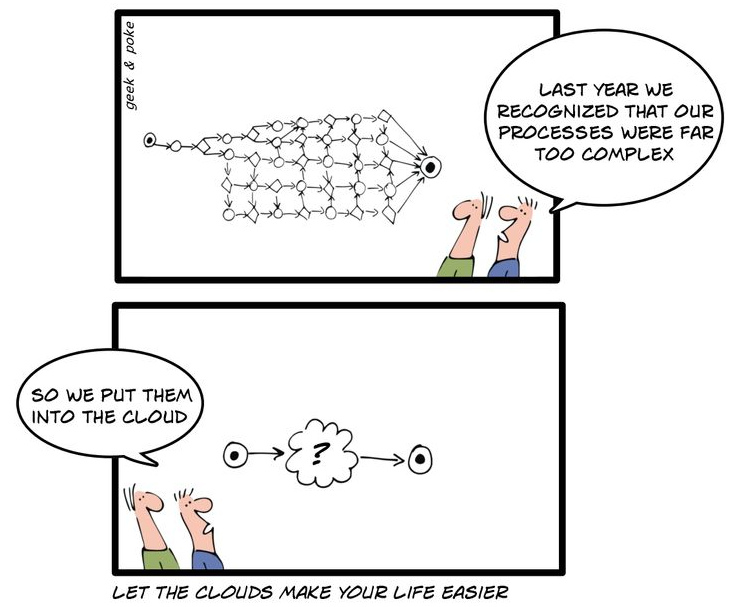

Data Management
========================================================

For Scientific Research

[//]: # (author: Brian High, UW DEOHS)
[//]: # (date: 2014-04-03)
[//]: # (license: CC0 1.0 Universal,linked-content/images)
[//]: # (note: License does not apply to external content such as quoted material, linked web pages, images, or videos. These are licensed separately by their authors, publishers or other copyright holders. See attribution links for details.)
[//]: # (note: Any of the trademarks, service marks, collective marks, design rights, personality rights, or similar rights that are mentioned, used, or cited in the chapters and appendices of the Structured Anaylsis Wiki are the property of their respective owners.)
[//]: # (homepage: https://github.com/brianhigh/data-workshop)

Photo: &copy; <a href="http://www.stanza.co.uk/body/index.html">Stanza</a>. Used with permission.

Session 2: Mobile Data Collection
========================================================

---

Photo: D. Hakes / <a href="http://blog.cartercenter.org/2012/08/06/carter-center-on-leading-edge-of-technology-use-in-election-observation/">The Carter Center</a>

*Election observation, Cairo polling station, May 24, 2012.*

Data Collection Goals
==================================

Ideal features of data collection:
 
* Standardized
* Ease of collection by researchers
* Ease of survey use by participants
* Flexibility with types of data samples
* Data security
 

Common Data Collection Problems
====================================
 
* Consistency between form or survey data and database structure
* Transcription or legibility errors between data collection and database storage
* Forms may need to be updated or changed
* Literacy or language barriers with written surveys
* Extra equipment needed to collect non-text data
* Secure data transfer and storage
 

Open Data Kit
========================================================
left: 50%

Open Data Kit is an open source tool for solving many data collection problems. It consists of:
 
* An Android tablet or phone and app for data collection
* A server instance to store and view collected data
* Powerful form and survey creation

---

Image: <a href="http://ehealthafrica.org/mhealth/">eHealth Africa</a>

ODK Solutions: Secure Data Collection
=======================================
left: 70%

* Data transmission to the server is encrypted with SSL
* Data is stored in a secure database on the ODK server

---

Source: <a href="http://sa-ki.deviantart.com/">sa-ki.deviantart.com</a>

ODK Solutions: Several Data Types
=======================================

Collecting data on a phone or tablet allows for the following data types to be collected:

* Text
* Images
* Video
* Audio
* GPS coordinates
* Barcode scanning

---

Image: Google Play Store

   
ODK Solutions: Powerful Forms
=======================================

Forms are powerful and flexible, for example:
* Alternate languages for survey questions
* Audio, image, and video components to questions
* Branching question paths:
  If A1 is 'yes', show Q2
* Calculations on answered questions: Q3 = A1 + A2
* Multiple choice questions: single or multiple answer
* Repeatable question sections
* Automatic meta data, such as survey start and end times

ODK Demos...
========================================================

We will now demonstrate:

* ODK Collect (app)
* ODK Aggregate (server)
* ODK Form Creation

---

Image: <a href="http://uclexcites.wordpress.com/2012/07/05/anti-poaching-application/">Michalis Vitos</a>

ODK Collect Demo
========================================================

* How to get the ODK Collect App
* How to get forms
* How to fill them out
* And how to upload

---

Image: <a href="http://cropmonitoring.appspot.com/methodology.html">AI-DEV Group, Makerere University </a>

ODK Aggregate Demo
========================================================

* Logging onto the Aggregate instance
* User accounts
* Viewing data and forms
* Exporting data

---

  

ODK Form Creation Demo
========================================================

There are three ways to make data input forms for ODK:

1. Using [ODK Build](http://build.opendatakit.org/) web app
2. Manually, by editing an [XML file](http://opendatakit.org/help/form-design/) in a text editor
3. Using [XLSForms](http://opendatakit.org/use/xlsform/) from a Spreadsheet (XLS)

---

Hands-on Group Exercise
========================================================

Working as a group, create some ODK forms for your project.

Photo: <a href="http://upload.wikimedia.org/wikipedia/commons/thumb/c/c1/Group_visioning_session_-_group_one_-_Stierch.jpg/640px-Group_visioning_session_-_group_one_-_Stierch.jpg">SarahStierch / Wikimedia</a>

Discussion
========================================================

We will discuss your ODK forms.

Graphic: <a href="http://upload.wikimedia.org/wikipedia/commons/e/eb/User_journey_discussion.png">Jagbirlehl / Wikimedia</a>

In the Coming Sessions...
========================================================

* More Systems Analysis Diagrams
* Requirements Document
* Feasibility Study
* Relational Database Design
* Entity-Relationship Diagrams
* MySQL Workbench

Action Items (videos, readings,  and tasks)
========================================================

<table>
   <tr border=0>
      <td width="128" valign="middle">
      </td>
      <td valign="middle">
         <ul>
            <li><a href="https://www.youtube.com/user/odkteam/videos?shelf_id=1&sort=dd&view=0">ODK Videos</a> - Watch one or two
            <li><a href="https://www.youtube.com/watch?v=0ZAP2y5PFNc">Business Data Modeling</a>
            <li>DFD: <a href="https://www.youtube.com/watch?v=KA4rRnihLII">How to Draw a DFD</a> and <a href="https://www.youtube.com/watch?v=N76olMe_IY0">DFD Example</a> - 3 parts         
            <li>SLD: <a href="https://www.youtube.com/watch?v=Cm1n30o9jjM">Swim Lane Diagram Tutorial</a> and <a href="https://www.youtube.com/watch?v=jvMdAldXdl0">Business Process Models in Visio</a>
         </ul>
      </td>
   </tr>
   <tr>
      <td width="128" valign="middle">
      </td>
      <td valign="middle">
         <ul>
            <li><A href="http://practicalcomputing.org/about">PCfB</a> textbook: Chapter4. Command-line Operations: the Shell
            <li>Skim: eBook: <a href="http://seattle.bibliocommons.com/item/show/2847668030_visual_models_for_software_requirements">Visual Models for Software Req.</a> - Ch. 20 and 21
            <li>Skim: Wikipedia articles: <a href="http://en.wikipedia.org/wiki/Data_model">Data model</a>, <a href="http://en.wikipedia.org/wiki/Data_flow_diagram">DFD</a>, <a href="http://en.wikipedia.org/wiki/Swim_lane">Swim lane</a>
            <li>Optional- Skim: <a href="http://www.amazon.com/dp/0123747309">RDDaI3CE</a> textbook: Chapters 1-2
         </ul>
      </td>
   </tr>
   <tr>
      <td width="128" valign="middle"></td>
      <td valign="middle">
         <ul>
            <li>Make ODK forms for your research project. 
            <li>Upload the forms to the in-house ODK Aggregate Server.
            <li>Be ready to present them for next session.
            <li>Find an alternative to ODK, compare/contrast, and present.
         </ul>
      </td>
   </tr>
</table>

See Also
========================================================

* [ODK](http://opendatakit.org/)
* [Comparison of Mobile Solutions for GIS Data Collection and Display](http://opendatakit.org/2011/12/comparison-of-mobile-solutions-for-gis-data-collection-and-display/)
* [EpiCollect.net](http://www.epicollect.net/)
* [GIS Cloud Mobile Data Collection](http://www.giscloud.com/apps/mobile-data-collection)
* [iFormBuilder Mobile Platform](https://www.iformbuilder.com/)
* [Automating Crop Surveillance](http://aidevmakerere.blogspot.com/2012/09/automating-crop-surveillance-theory-vs.html)

Questions and Comments 
========================================================

Image: <a href=http://commons.wikimedia.org/wiki/File:Happy_Question.svg">© Nevit Dilmen</a> / Wikimedia

Some Parting Words
========================================================

Image: <a href="http://geek-and-poke.com/">Geek and Poke</a>. Used with permission.

