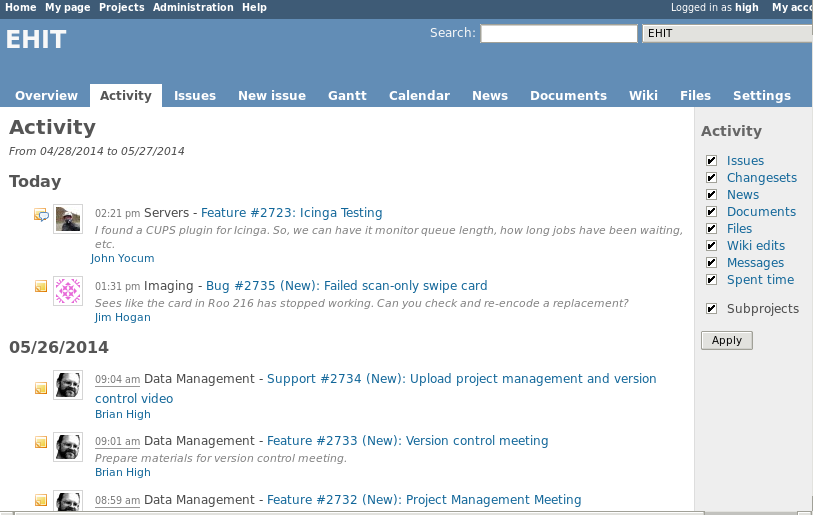
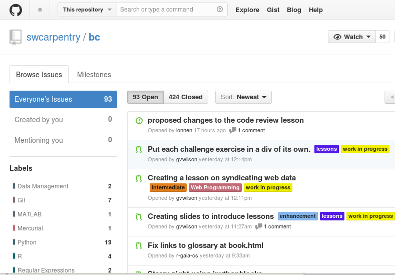
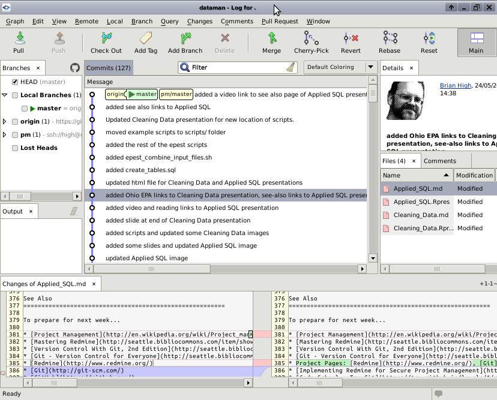
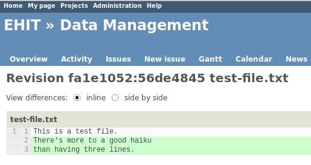
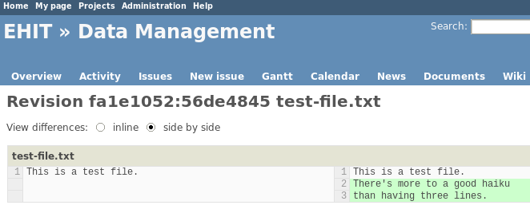
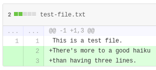
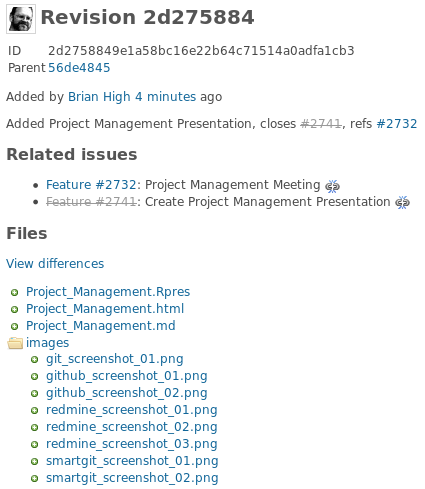
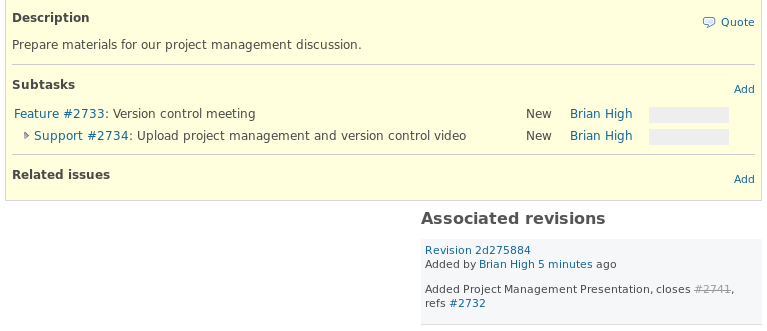

Data Management
========================================================

For Scientific Research

[//]: # (author: Brian High, UW DEOHS)
[//]: # (date: 2014-05-27)
[//]: # (license: CC0 1.0 Universal,linked-content/images)
[//]: # (note: License does not apply to external content such as quoted material, linked web pages, images, or videos. These are licensed separately by their authors, publishers or other copyright holders. See attribution links for details.)
[//]: # (note: Any of the trademarks, service marks, collective marks, design rights, personality rights, or similar rights that are mentioned, used, or cited in the presentations and wiki of the Data Management For Scientific Research workshop/course are the property of their respective owners.)
[//]: # (homepage: https://github.com/brianhigh/data-workshop)

<p style="width: 600px; float: right; clear: right; margin-bottom: 5px; margin-left: 10px; text-align: right; font-weight: bold; font-size: 14pt;">Photo: &copy; <a href="http://www.stanza.co.uk/body/index.html">Stanza</a>. Used with permission.</p>

Session 8: Project Management
========================================================

> Project management is the process and activity of planning, organizing, motivating, and controlling resources, procedures and protocols to achieve specific goals in scientific or daily problems.

Source: [Wikipedia](http://en.wikipedia.org/wiki/Project_management)

<p style="width: 800px; float: left; clear: right; margin-bottom: 5px; margin-left: 10px; text-align: right; font-weight: bold; font-size: 14pt;">Image: <a href=http://commons.wikimedia.org/wiki/File:Project_Management_%28phases%29.png">Alphamu57 / Wikimedia</a></p>


"Traditional" Approach
========================================================

1. Initiation
2. Planning and design
3. Execution and construction
4. Monitoring and controlling systems
5. Completion

<p style="width: 800px; float: left; clear: right; margin-bottom: 5px; margin-left: 10px; text-align: right; font-weight: bold; font-size: 14pt;">Image: <a href=http://commons.wikimedia.org/wiki/File:Project_Management_%28phases%29.png">Alphamu57 / Wikimedia</a></p>

"Agile" Approach
========================================================

* Plan
* Collaborate
* Deliver

<p style="width: 800px; float: left; clear: right; margin-bottom: 5px; margin-left: 10px; text-align: right; font-weight: bold; font-size: 14pt;">Image: <a href="http://commons.wikimedia.org/wiki/File:Agile_Project_Management_by_Planbox.png">Planbox / Fongamanda / Wikimedia</a></p>

Project Management Constraints
=================================================

* Scope
* Time (Schedule)
* Cost
* Quality

<p style="width: 613px; float: left; clear: right; margin-bottom: 5px; margin-left: 10px; text-align: right; font-weight: bold; font-size: 14pt;">Image: <a href="http://commons.wikimedia.org/wiki/File:The_triad_constraints.jpg">John Manuel Kennedy T. / Wikimedia</a></p>

Redmine: Self-Hosted Project Management
=================================================



GitHub: Cloud-Hosted Project Management
=================================================



Redmine and GitHub Common Features
========================================================

* Web-based
* Multi-user
* User/role management
* Workflow management
* Documentation (wiki, files)
* Issue tracking (bug reporting)
* Notifications (email)
* Status reports and charts
* Version control

Version Control Systems (VCS)
========================================================

... allow you to:

* Keep a log of all "commits"
* Store complete history
* Retrieve old versions
* Compare with "diff"
* Branching and merging
* Local, centralized, or distributed

---

<p style="width: 200px; float: left; clear: right; margin-bottom: 5px; margin-left: 10px; text-align: right; font-weight: bold; font-size: 14pt;">Image: <a href="http://commons.wikimedia.org/wiki/File:Revision_controlled_project_visualization-2010-24-02.svg">JSami Kerola/ Moxfyre / Echion2 / Wikimedia</a></p>

Git: A popular, free VCS
========================================================

* Fast, compact, and scalable
* Excellent branching and merging
* Distributed
* Runs on all major platforms
* Several free hosting options
* Integrates well (with e.g. Redmine)
* Many graphical clients available

Git: Command Line Interface (CLI)
========================================================


```git log --graph --decorate --all --pretty=oneline```


Git: Graphical User Interface (GUI)
========================================================



Hands-on Group Exercise: Using Git
========================================================

* [git config](https://www.kernel.org/pub/software/scm/git/docs/git-config.html)
* [git init](https://www.kernel.org/pub/software/scm/git/docs/git-init.html)
* [git clone](https://www.kernel.org/pub/software/scm/git/docs/git-clone.html)
* [git status](https://www.kernel.org/pub/software/scm/git/docs/git-status.html)
* [git add](https://www.kernel.org/pub/software/scm/git/docs/git-add.html)
* [git commit](https://www.kernel.org/pub/software/scm/git/docs/git-commit.html)
* [git log](https://www.kernel.org/pub/software/scm/git/docs/git-log.html)
* [git mv](https://www.kernel.org/pub/software/scm/git/docs/git-mv.html)
* [git diff](https://www.kernel.org/pub/software/scm/git/docs/git-diff.html)
* [git checkout](https://www.kernel.org/pub/software/scm/git/docs/git-checkout.html)

---

* [git remote](https://www.kernel.org/pub/software/scm/git/docs/git-remote.html)
* [git push](https://www.kernel.org/pub/software/scm/git/docs/git-push.html)
* [git pull](https://www.kernel.org/pub/software/scm/git/docs/git-pull.html)
* [git tag](https://www.kernel.org/pub/software/scm/git/docs/git-tag.html)
* [git branch](https://www.kernel.org/pub/software/scm/git/docs/git-branch.html)
* [git stash](https://www.kernel.org/pub/software/scm/git/docs/git-stash.html)
* [git fetch](https://www.kernel.org/pub/software/scm/git/docs/git-fetch.html)
* [git rebase](https://www.kernel.org/pub/software/scm/git/docs/git-rebase.html)
* [git reset](https://www.kernel.org/pub/software/scm/git/docs/git-reset.html)
* [git revert](https://www.kernel.org/pub/software/scm/git/docs/git-revert.html)

git clone
========================================================

Clone a repository into a new directory

```{bash}
mkdir git-test
cd git-test
git clone ssh://high@git.deohs.washington.edu/opt/git/ehit/dataman.git
```

```
Cloning into 'dataman'...
remote: Counting objects: 637, done.
remote: Compressing objects: 100% (316/316), done.
remote: Total 637 (delta 338), reused 602 (delta 320)
Receiving objects: 100% (637/637), 18.06 MiB | 23.93 MiB/s, done.
Resolving deltas: 100% (338/338), done.
```


git add
========================================================

Add file contents to the index 

```{bash}
cd dataman
echo "This is a test file." > test-file.txt
git add test-file.txt
```

git status
========================================================

Show the working tree status 

```{bash}
git status
```
```
# On branch master
# Changes to be committed:
#   (use "git reset HEAD <file>..." to unstage)
#
#  new file:   test-file.txt
#
```

git commit
========================================================

Record changes to the repository 

```{bash}
git commit -m "Adding new test file"
```
```
[master fa1e105] Adding new test file
 1 file changed, 1 insertion(+)
 create mode 100644 test-file.txt
```
```{bash}
git status
```
```
# On branch master
# Your branch is ahead of 'origin/master' by 1 commit.
#
nothing to commit (working directory clean)
```

git push
========================================================

Update remote refs along with associated objects

```{bash}
git push
```
```
Counting objects: 4, done.
Delta compression using up to 8 threads.
Compressing objects: 100% (2/2), done.
Writing objects: 100% (3/3), 296 bytes, done.
Total 3 (delta 1), reused 0 (delta 0)
To ssh://high@git.deohs.washington.edu/opt/git/ehit/dataman.git
   44d1fca..fa1e105  master -> master
```

git log
========================================================

Show commit logs 

```{bash}
git log
```

```
commit fa1e10522de9ea3b21b304d16ee4d3fdcece71b8
Author: Brian High <high@uw.edu>
Date:   Wed May 28 16:16:58 2014 -0700

    Adding new test file
...
```

git log (graph, decorate, all, oneline)
========================================================

```{bash}
git log --graph --decorate --all --pretty=oneline
```


git diff
========================================================

Show changes between commits, commit and working tree, etc 

```{bash}
echo "There's more to a good haiku" >> test-file.txt
echo "than having three lines." >> test-file.txt
git diff
```
```
diff --git a/test-file.txt b/test-file.txt
index 6de7b8c..4844fe6 100644
--- a/test-file.txt
+++ b/test-file.txt
@@ -1 +1,3 @@
 This is a test file.
+There's more to a good haiku
+than having three lines.
```

```git diff``` shows a [unified diff](http://en.wikipedia.org/wiki/Diff#Unified_format).


diff as seen in Redmine and GitHub
========================================================

Redmine:




---

GitHub:



Redmine and Git Integration
=========================================================

Redmine integrates repositories using special syntax in issues and commits.

* [Referencing issues in commit messages](http://www.redmine.org/projects/redmine/wiki/RedmineSettings#Referencing-issues-in-commit-messages)
* [How to link to Git commit?](http://www.redmine.org/boards/2/topics/15536?r=35831)


---



Closing Issues with Git Commits
=========================================================

```{bash}
git commit -m "Added Project Management Presentation, closes #2741, refs #2732"
```



Discussion
========================================================

We will discuss your experiences with Git. Is version control worth the effort?

<p style="width: 275px; float: left; clear: right; margin-bottom: 5px; margin-left: 10px; text-align: right; font-weight: bold; font-size: 14pt;">Graphic: <a href="http://upload.wikimedia.org/wikipedia/commons/e/eb/User_journey_discussion.png">Jagbirlehl / Wikimedia</a></p>


In the Coming Sessions...
========================================================

* Data Security
* Systems Administration

Action Items (videos, readings,  and tasks)
========================================================

<table>
   <tr border=0>
      <td width="128" valign="middle">
      </td>
      <td valign="middle">
         <ul>
            <li>TED: <a href="https://www.youtube.com/watch?v=hqKafI7Amd8">Hacking [1]</a>, <a href="http://www.ted.com/talks/avi_rubin_all_your_devices_can_be_hacked#t-258447">Hacking Devices [2]</a>, and <a href="https://www.youtube.com/watch?v=UPmVTPyE5DM">InfoSec [3]</a>
            <li><a href="https://www.youtube.com/watch?v=IoXoHlI86rQ">Schneier on Security [4]</a> and <a href="https://www.youtube.com/watch?v=1ZnKcDnapuY">Internet, Privacy & Security [5]</a>
            <li><a href="https://www.youtube.com/watch?v=x-jvuL7FYl8">Security Fundamentals [6]</a> and <a href="https://www.youtube.com/watch?v=nJtbmk5cLcY">Data Security Awareness [7]</a>
            <li>Skim Playlists: <a href="https://www.youtube.com/watch?v=IaOMy-FqpLY&list=PLUKTA1-FvEn_wYfQEHM4rNwxXyqMpzyU6">Encryption</a> and <a href="https://www.youtube.com/watch?v=cf1FrIs3Ero&list=PLxttiYSVvMQxjt7Fho8YyAvjFizMbnjTO">Privacy Security Forum</a>
         </ul>
      </td>
   </tr>
   <tr>
      <td width="128" valign="middle">
      </td>
      <td valign="middle">
         <ul>
            <li><A href="http://practicalcomputing.org/about">PCfB</a> textbook: Chapter 21. Installing Software
            <li>Skim: <a href="http://seattle.bibliocommons.com/item/show/2897906030_sams_teach_yourself_sql_in_10_minutes,_fourth_edition">SAMS Teach Yourself SQL on 10 Minutes</a>: Ch. 15-18
            <li>Optional- Skim: <a href="http://www.amazon.com/dp/0123747309">RDDaI3CE</a> textbook: Chapter 15
            <li>Optional- Skim: <a href="http://www.amazon.com/dp/0123756979">SQLCE3</a> textbook: Chapters 9-12
         </ul>
      </td>
   </tr>
   <tr>
      <td width="128" valign="middle"></td>
      <td valign="middle">
         <ul>
            <li>Clone your Git repo. Add/commit/push your project code.
            <li>Make a branch, change the branch, and merge into "master".
            <li>Do the same from a graphical Git client. Which is easiest?
            <li>Make Redmine issues that reference commits and vice-versa.
         </ul>
      </td>
   </tr>
</table>


See Also
========================================================

* [Project Management](http://en.wikipedia.org/wiki/Project_management),  [Version Control](http://en.wikipedia.org/wiki/Version_control), [diff](http://en.wikipedia.org/wiki/Diff), and [patch](http://en.wikipedia.org/wiki/Patch_%28Unix%29)
* [Mastering Redmine](http://seattle.bibliocommons.com/item/show/2920711030_mastering_redmine) eBook
* [Version Control With Git, 2nd Edition](http://seattle.bibliocommons.com/item/show/2847665030_version_control_with_git,_2nd_edition) eBook
* [Git - Version Control for Everyone](http://seattle.bibliocommons.com/item/show/2937299030_git_-_version_control_for_everyone) eBook
* [Git Magic](http://www-cs-students.stanford.edu/~blynn/gitmagic/) eBook
* Project Pages: [Redmine](http://www.redmine.org/), [Git](http://git-scm.com/), [GitHub](https://github.com/)
* [Implementing Redmine for Secure Project Management](http://www.sans.org/reading-room/whitepapers/testing/implementing-redmine-secure-project-management-34122)
* [Code School - Try Git](https://try.github.io/levels/1/challenges/1) - 15 minute online Git tutorial
* [6 Useful Graphical Git Client for Linux](http://www.maketecheasier.com/6-useful-graphical-git-client-for-linux/) Guide
* [Git Cheat Sheet](http://www.cheat-sheets.org/saved-copy/git-cheat-sheet.pdf)
* [Introduction to Git](www.youtube.com/watch?v=ZDR433b0HJY) video
* [Getting Started with GitHub + Git](https://www.youtube.com/watch?v=DVDLoe_2MBc) video

Questions and Comments 
========================================================

<p style="width: 380px; float: right; clear: right; margin-bottom: 5px; margin-left: 10px; text-align: right; font-weight: bold; font-size: 14pt;">Image: <a href=http://commons.wikimedia.org/wiki/File:Happy_Question.svg">© Nevit Dilmen</a> / Wikimedia</p>


Some Parting Words
========================================================

> Version control is the lab notebook of the digital world.

--[Software Carpentry](http://software-carpentry.org/v5/novice/git/01-backup.html)


<p style="width: 851px; float: right; clear: right; margin-bottom: 5px; margin-left: 10px; text-align: right; font-weight: bold; font-size: 14pt;">Image: <a href="http://oystergen.es/data/">Steven Roberts</a></p>
