Data Management
========================================================

For Scientific Research

[//]: # (author: Brian High, UW DEOHS)
[//]: # (date: 2014-04-17)
[//]: # (license: CC0 1.0 Universal, linked-content/images)
[//]: # (note: License does not apply to external content such as quoted material, linked web pages, images, or videos. These are licensed separately by their authors, publishers or other copyright holders. See attribution links for details.)
[//]: # (note: Any of the trademarks, service marks, collective marks, design rights, personality rights, or similar rights that are mentioned, used, or cited in the presentations and wiki of the Data Management For Scientific Research workshop/course are the property of their respective owners.)
[//]: # (homepage: https://github.com/brianhigh/data-workshop)

Photo: &copy; <a href="http://www.stanza.co.uk/body/index.html">Stanza</a>. Used with permission.

Session 3: Systems Analysis and Design
========================================================

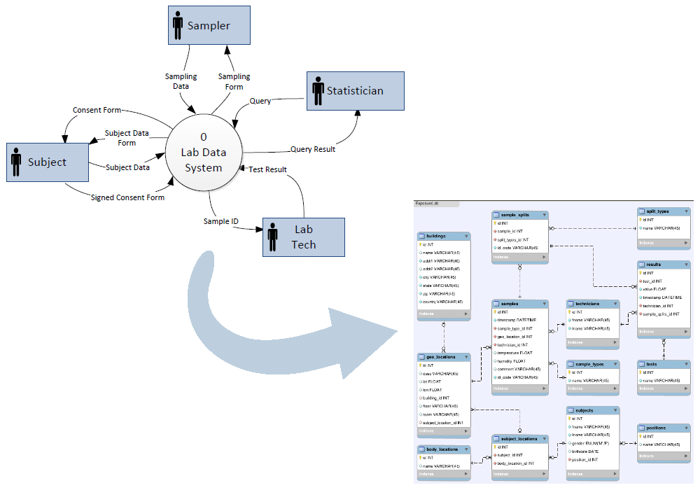

Systems Development Life Cycle (SDLC)
==================================

One of several approaches to systems development is the [SDLC](http://en.wikipedia.org/wiki/Systems_development_life_cycle), also called the "Waterfall" model.

Image: <a href="http://commons.wikimedia.org/wiki/File:Waterfall_model.svg">Peter Kemp / Paul Smith / Wikimedia</a>

Phases of the SDLC
==================================

| Phase | Purpose |
| ----- | ------- |
Preliminary analysis | Define purpose, scope, options, costs |
Systems analysis | Map processes, define requirements |
Systems design | Precise description of modular system |
Development | Build the working system from the design |
Integration and testing | Make sure system works |
Acceptance, installation, deployment | Put system to real use |
Maintenance | Keep system running properly |
Evaluation | Make sure system is still serving its purpose |
Disposal | Remove system when no longer needed |

(Source: [Wikipedia](http://en.wikipedia.org/wiki/Systems_development_life-cycle))

An Example Research Project
==================================

Let's imagine that we are to conduct a research study like this:
 
* We will sample various surfaces for bacteria.
* Some of those surfaces will be on human subjects.
* We will analyze the bacteria samples in the lab.
* Test results will be entered into a data system.
* We will perform statistical analyses on the test results. 

Goals List
===================================

The stakeholder goals for system, in "verb noun" form are:

| Role | Goal |
| ---- | ---- |
| Subject | Sign Consent Form  |
| Sampler | Collect Consent Form  |
| Subject | Complete Subject Form  |
| Sampler | Collect Subject Form  |
| Sampler | Collect Sample  |
| Sampler | Deliver Sample |
| Lab Tech | Test Sample  |
| Lab Tech | Dispose Sample |
| Statistician | Analyze Results |

Structured Narratives
====================================

From this goals list, we can create use case diagrams and a structured narrative. A structured narrative is a description which conforms to some sort of standardized format. 

For the purposes of our preliminary investigation, we will just add one-sentence descriptions for each goal in our list. Our description will use terms such as "if", "must" or "may" and phrases like "for each" or "for all". 

This simple structure will allow us to develop a process model using various types of diagrams. From our process model, we will develop a data model.

Structured Narrative: Part 1, Subject Data
====================================

| Actor | Use Case | Description | 
| ----- | -------- | -------------------- |
| Subject | Sign Consent Form  | If a human subject is sampled, the subject must sign a consent form. |
| Sampler | Collect Consent Form | The sampler must collect the consent form before sampling the subject. |
| Subject | Complete Subject Data Form | The subject must complete a subject data form by providing personal information. |
| Sampler | Collect Subject Data Form | The sampler must collect the subject data form before sampling the subject. |

Structured Narrative: Part 2, Sampling
====================================

| Actor | Use Case | Description | 
| ----- | -------- | -------------------- |
| Sampler | Enter Subject Data | The sampler must enter subject information into the system for each human subject sampled. |
| Sampler | Collect Sample  | The sampler may collect a sample from a human subject or from a non-human surface. |
| Sampler | Record Geo Location | The sampler must record the geographical sampling location for all samples taken. |
| Sampler | Record Body Location | The sampler must record the human body sampling location for all samples taken from human subjects. |
| Sampler | Record Temperature | The sampler must record a temperature reading for all samples taken. |
| Sampler | Record Humidity | The sampler must record a humidity reading for all samples taken. |
| Sampler | Enter Sample Data | The sampler must enter sample information into the system for each sample collected. |
| Sampler | Deliver Sample | The sampler must deliver the sample to the laboratory. |

Structured Narrative: Part 3, Analysis
====================================

| Actor | Use Case | Description | 
| ----- | -------- | -------------------- |
| Lab Tech | Receive Sample | The laboratory technician must receive the sample when it is delivered. |
| Lab Tech | Store Sample | The laboratory technician must store the sample in a cooler (refrigerator). |
| Lab Tech | Split Sample | The laboratory technician must split the sample before testing. |
| Lab Tech | Test Sample  | The laboratory technician must test the sample before it expires. |
| Lab Tech | Enter Test Result  | The laboratory technician must enter the test result into the system. |
| Lab Tech | Dispose Sample | The laboratory technician must dispose of the sample after it is no longer needed. |
| Statistician | Query Results | The statistician may query the system for test results. |
| Statistician | Analyze Results | The statistician may analyze the results using statistical tools. |

Use Case Narratives
====================================

For even more clarity, one can also develop [use case narratives](http://businessanalystmentor.com/2008/12/03/use-cases-the-use-case-narrative/), which go into far greater detail. This level of detail might be useful in later design phases.

Image: <a href="http://www.cigi.illinois.edu/cybergis-project/Feb2011Workshop.php">UI CyberGIS Project</a>

Use Case Diagrams: Project Overview
====================================

This diagram shows the actors and their project goals.

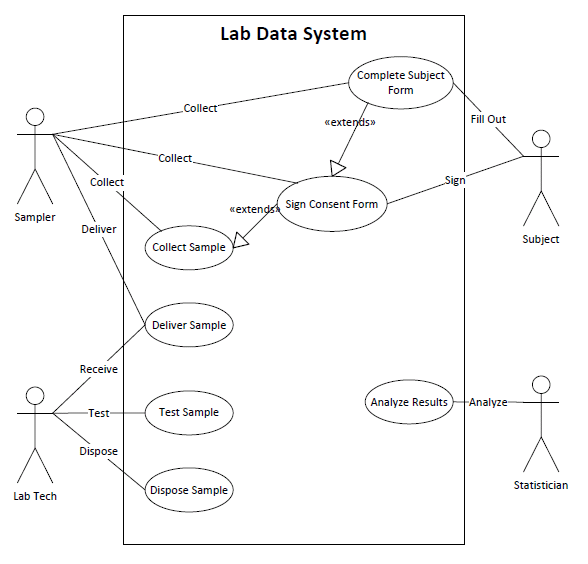

Use Case Diagrams: More Detailed View
====================================

This diagram shows a more detailed view of the actors and their project goals.

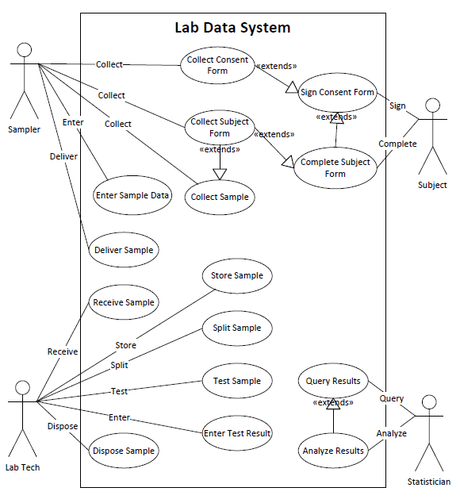

Flow Charts
====================================

To better elucidate process branching in a system, we can use a flow chart. Here is a closer look at the sampling process. 

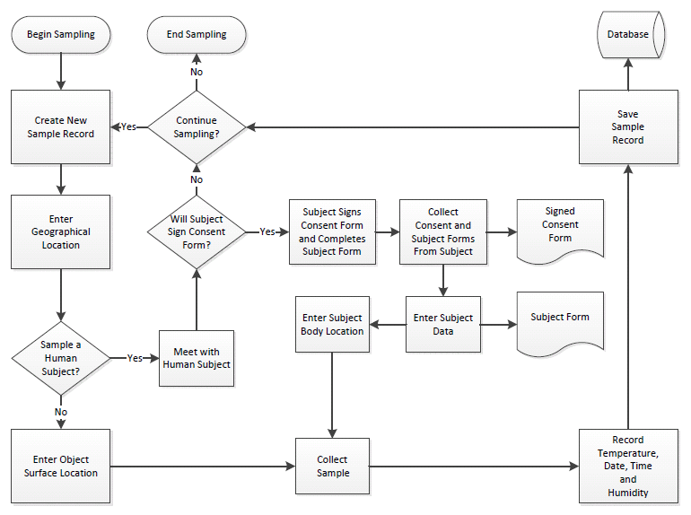

Swim Lane Diagrams
====================================

This swim lane diagram shows an overview of the system. The lanes not only show actors, but also sequence and outputs.

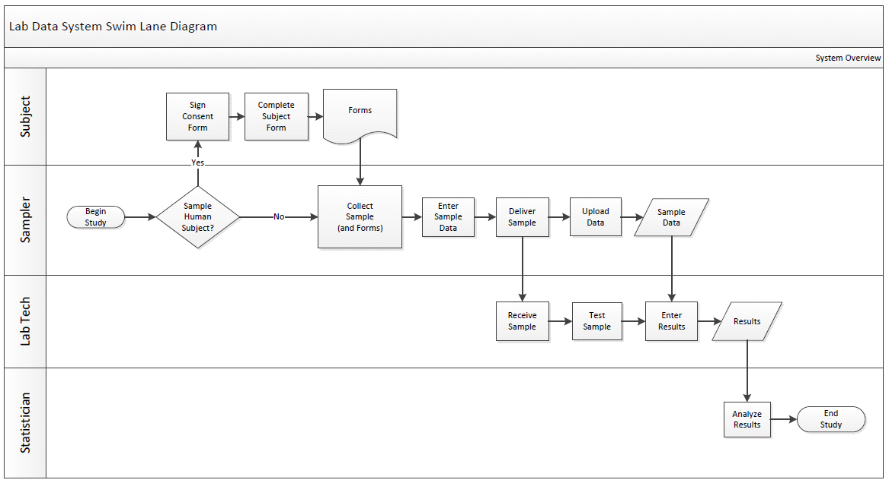

Data Flow Diagrams
====================================

Context Diagrams (Level 0)

* [Context Diagram with Gane/Sarson Symbols](images/Lab_Data_System_Context_Diagram_Gane.png)
* [Context Diagram with Yourdon/DeMarco Symbols and Curved Lines](images/Lab_Data_System_Context_Diagram_Yourdon_V1.png)
* [Context Diagram with Yourdon/DeMarco Symbols without Subject Entity](images/Lab_Data_System_Context_Diagram_Yourdon_V2.png)

Data Flow Diagrams (Level 1 and higher)

* [Level 1 Data Flow Diagram](images/Lab_Data_System_Level_1_DFD_Yourdon_Angled_Lines.png)
* [Level 1 Data Flow Diagram with Curved Lines](images/Lab_Data_System_Level_1_DFD_v1.png)
* [Level 1 Data Flow Diagram without Subject Entity](images/Lab_Data_System_Level_1_DFD_Yourdon_v2.png)

Context Diagram (Gane/Sarson Symbols)
====================================

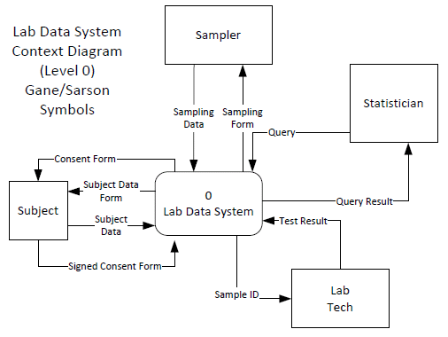

Context Diagram (Yourdon/DeMarco)
====================================

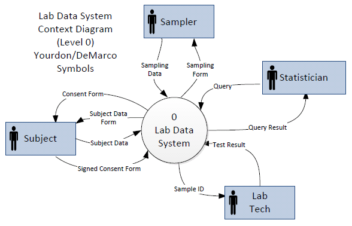

Context Diagram: Without Subject Entity
====================================

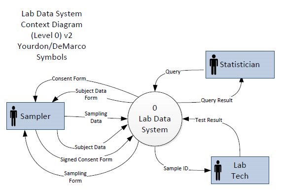

Level 1 Data Flow Diagram
====================================

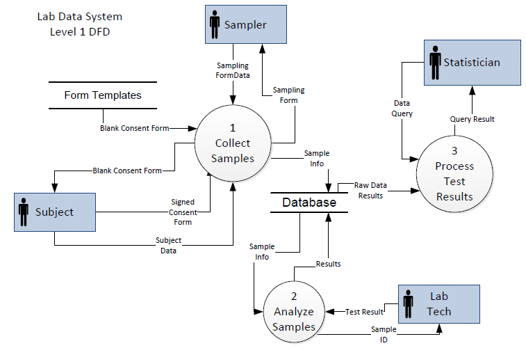

Level 1 DFD ... with Curved Lines
====================================

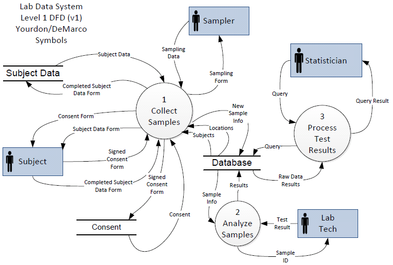

Level 1 DFD ... Without Subject Entity
====================================

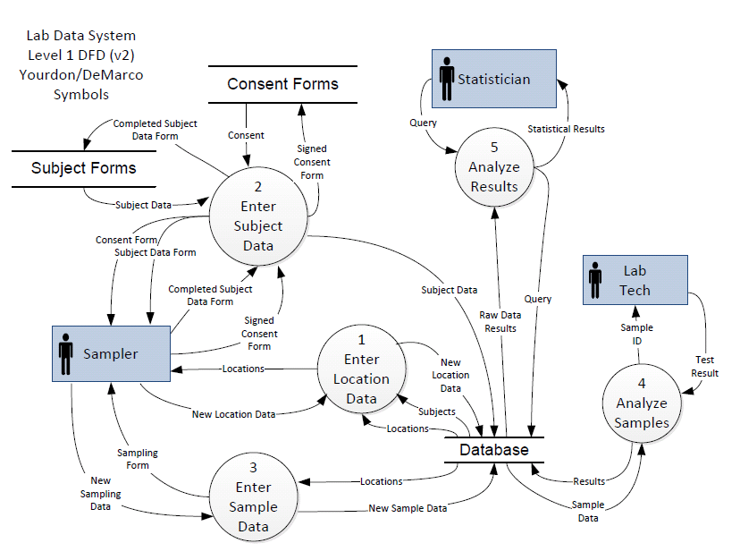

Hands-on Group Exercise
========================================================

Working as a group, with a pen or pencil and paper, make some systems analysis diagrams. Sticky notes, a whiteboard, etc. may be helpful when brainstorming and designing the diagrams.

Photo: <a href="http://upload.wikimedia.org/wikipedia/commons/thumb/c/c1/Group_visioning_session_-_group_one_-_Stierch.jpg/640px-Group_visioning_session_-_group_one_-_Stierch.jpg">SarahStierch / Wikimedia</a>

Hands-on Group Exercise: Variations
========================================================

Data Flow Diagrams

Transform your use case diagram(s) into a context diagram and level 1 DFD, especially if there are many data processing steps or data sources. Diagram further levels (time permitting).

---

Flow Charts and Swim Lanes

Alternatively, if there are complex decisions, branching, or multiple entities performing various actions, then make a flow chart or swim lane diagram from your use case diagram(s). 

Discussion
========================================================

Explain your diagrams to the group as though you were presenting your data system requirements to those who would build the data system. Ask questions that a system implementer might ask, especially where there are ambiguities.

Graphic: <a href="http://upload.wikimedia.org/wikipedia/commons/e/eb/User_journey_discussion.png">Jagbirlehl / Wikimedia</a>

In the Coming Sessions...
========================================================

* Entity-Relationship Diagrams
* MySQL Workbench
* Building Database Tables
* Database Applications

Action Items (videos, readings,  and tasks)
========================================================

<table>
   <tr border=0>
      <td width="128" valign="middle">
      </td>
      <td valign="middle">
         <ul>
            <li><a href="https://www.youtube.com/watch?v=O4PXqpv8TAw">Conceptual Data Modeling</a>
            <li><a href="https://www.youtube.com/watch?v=V5DyvUfsboA">Defining table relationships</a>
            <li><A href="https://www.youtube.com/watch?v=SVV7HjKmFY4">Databases and SQL</a>
            <li><a href="https://www.youtube.com/watch?v=-fQ-bRllhXc">ERD Training</a>
         </ul>
      </td>
   </tr>
   <tr>
      <td width="128" valign="middle">
      </td>
      <td valign="middle">
               <ul>
            <li><A href="http://practicalcomputing.org/about">PCfB</a> textbook: Chapter5. Handling Text in the Shell
            <li>Skim: Wikipedia: <a href="http://en.wikipedia.org/wiki/Requirements_analysis">Req. anal.</a>, <a href="http://en.wikipedia.org/wiki/Database_design"</a>DB design, <a href="http://en.wikipedia.org/wiki/Entity%E2%80%93relationship_model">E-R model</a>, and <a href="http://en.wikipedia.org/wiki/Database_normalization">normalization</a>
            <li>Explore: <A href="http://ciso.uw.edu/privacy/">UW Privacy Program</a>, <a href="http://yourdon.com/strucanalysis/wiki/index.php/Introduction">Structured Analysis Wiki</a>
            <li>Optional- Skim: <a href="http://www.amazon.com/dp/0123747309">RDDaI3CE</a> textbook: Chapters 3-4
         </ul>
      </td>
   </tr>
   <tr>
      <td width="128" valign="middle"></td>
      <td valign="middle">
         <ul>
            <li> Create enough diagrams to describe your data system "unambiguously"
            <li> Post your system documents and diagrams in your project wiki
            <li> Organize your material into a "Requirements Document" wiki page
            <li> Refer to the example in the "Data Management" project wiki
         </ul>
      </td>
   </tr>
</table>

See Also
========================================================

* [Rapid application development](http://en.wikipedia.org/wiki/Rapid_application_development)
* [Creately - Ultimate Flowchart Guide](http://creately.com/blog/diagrams/flowchart-guide-flowchart-tutorial/)
* [Traditional vs Modern Flowcharts](http://www.smartdraw.com/articles/flowchart/traditional-vs-modern-flowcharts.htm)
* [DFD over Flowcharts PDF](http://ratandon.mysite.syr.edu/cis453/notes/DFD_over_Flowcharts.pdf)
* [DFD Slideshow](http://www.slideshare.net/NidhiSharma78/data-flow-diagram-17909732)
* [Creately DFD](http://creately.com/diagram-community/popular/t/data-flow)
* [DFDs - and follow link to "Article"](http://indianatech2.net/dfd.html)
* [UML Data Modeling Video](https://www.youtube.com/watch?v=OOpiaIcyz30)
* [Graphical Data Flow Programming in LabVIEW Video](https://www.youtube.com/watch?v=PqxStfwjQoQ&list=PLB968815D7BB78F9C)

Questions and Comments 
========================================================

Image: <a href=http://commons.wikimedia.org/wiki/File:Happy_Question.svg">© Nevit Dilmen</a> / Wikimedia

Some Parting Words
========================================================

> Essentially, all models are wrong, but some are useful.

--*<a href="http://en.wikipedia.org/wiki/George_E._P._Box">George E. P. Box</a>*

Source: *Empirical Model-Building and Response Surfaces* (1987), p. 424. (Found on <a href="http://en.wikiquote.org/wiki/George_E._P._Box">Wikiquote</a>.)

